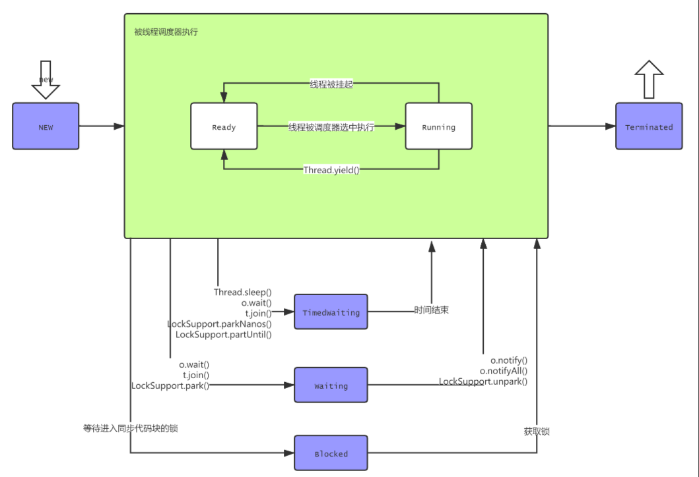

# 并发编程（一）：了解Thread

## 引言

**线程是进程中可独立执行的最小单位，也是CPU资源分配的基本单位。**

### 线程的四个基本属性

|属性	|描述|
|---|---|
|编号id	|线程的唯一标识|
|名称	|线程的名字，默认“Thread-编号id”，可自定义|
|类别	|分为守护线程和用户线程，可以通过setDaemon(true)设置为守护线程|
|优先级	|表示希望哪个线程优先执行，Java中优先级取值范围是1~10，默认5|

### Java线程的六个状态

1. **初始(NEW)**：新创建了一个线程对象，但还没有调用`start()`方法。
2. **运行(RUNNABLE)**：Java线程中将就绪（`ready`）和运行中（`running`）两种状态笼统的称为 **“运行”**。
线程对象创建后，其他线程(比如main线程）调用了该对象的`start()`方法。该状态的线程位于可运行线程池中，等待被线程调度选中，获取CPU的使用权，此时处于就绪状态（`ready`）。
就绪状态的线程在获得CPU时间片后变为运行中状态（`running`）。
3. **阻塞(BLOCKED)**：表示线程阻塞于锁。
4. **等待(WAITING)**：进入该状态的线程需要等待其他线程做出一些特定动作（通知或中断）。
5. **超时等待(TIMED_WAITING)**：该状态不同于`WAITING`，它可以在指定的时间后自行返回。
6. **终止(TERMINATED)**：表示该线程已经执行完毕。

### 状态详细说明

**1、初始状态(NEW)**

实现`Runnable`接口和继承`Thread`可以得到一个线程类，`new`一个实例出来，线程就进入了初始状态。

**2.1、就绪状态(RUNNABLE之READY)**

就绪状态只是说你资格运行，调度程序没有挑选到你，你就永远是就绪状态。调用线程的`start()`方法，此线程进入就绪状态。当前线程`sleep()`方法结束，其他线程`join()`结束，等待用户输入完毕，某个线程拿到对象锁，这些线程也将进入就绪状态。

当前线程时间片用完了，调用当前线程的`yield()`方法，当前线程进入就绪状态。锁池里的线程拿到对象锁后，进入就绪状态。

**2.2、运行中状态(RUNNABLE之RUNNING)**

线程调度程序从可运行池中选择一个线程作为当前线程时线程所处的状态。这也是线程进入运行状态的唯一的一种方式。

**3、阻塞状态(BLOCKED)**
   
阻塞状态是线程阻塞在进入`synchronized`关键字修饰的方法或代码块(获取锁)时的状态。

**4、等待(WAITING)**
   
处于这种状态的线程不会被分配CPU执行时间，它们要等待被显式地唤醒，否则会处于无限期等待的状态。

**5、超时等待(TIMED_WAITING)**
   
处于这种状态的线程不会被分配CPU执行时间，不过无须无限期等待被其他线程显示地唤醒，在达到一定时间后它们会自动唤醒。

**6、终止状态(TERMINATED)**
   
当线程的`run()`方法完成时，或者主线程的`main()`方法完成时，我们就认为它终止了。这个线程对象也许是活的，但是它已经不是一个单独执行的线程。线程一旦终止了，就不能复生。
在一个终止的线程上调用`start()`方法，会抛出`java.lang.IllegalThreadStateException`异常。


## Java线程对象Thread常用的方法

### start()

表示启动线程，让CPU调度器调度开启线程持行`run()`方法。而直接调用`run()`方法只是运行当前run方法，不会开启线程。

附上源码：

```java
public synchronized void start() {
      
        if (threadStatus != 0)
            throw new IllegalThreadStateException();

        group.add(this);

        boolean started = false;
        try {
            start0();
            started = true;
        } finally {
            try {
                if (!started) {
                    group.threadStartFailed(this);
                }
            } catch (Throwable ignore) {
              
            }
        }
    }

    private native void start0();
```

通过源码，不难发现`start()`方法实际上是调用`start0()`方法启动线程的，而`start0()`是native方法。

:::tip 简单说下native的原理及实现机制

`native`修饰的表示本地方法，一个`Native Method`就是一个java调用非java代码(如C代码)的接口，Java中的`Native Method`并不提供实现体。

当一个类第一次被使用到时，这个类的字节码会被加载到内存，并且只会会被载一次。在这个被加载的字节码的入口维持着一个该类所有方法描述符的list，这些方法描述符包含这样一些信息：方法代码存于何处，它有哪些参数，方法的描述符（public之类）等等。

如果一个方法描述符内有`native`，这个描述符块将有一个指向该方法的实现的指针。这些实现在一些DLL文件内，但是它们会被操作系统加载到Java程序的本地方法栈。当一个带有本地方法的类被加载时，
其相关的DLL并未被加载，因此指向方法实现的指针并不会被设置。只有当本地方法被调用时，这些DLL才会被加载，这是通过调用`java.system.loadLibrary()`实现的。

此外，不可不说的是，本地方法意味着和平台有关，因此使用了`native`的程序可移植性都不太高，并且本地方法是有开销的，它丧失了Java的很多优势。
:::

### sleep()

线程暂停阻塞等待一段时间，时间过了就继续。**该方法是不释放锁的**。

附源码：

```java
public static native void sleep(long millis) throws InterruptedException
```

同样的，`sleep()`也是本地方法，底层也是通过C代码调用操作系统实现的

### yield()

`t.yield()`表示t线程主动让出CPU执行权进入**就绪态**，所有线程重新争抢CPU（可能出现又是t线程抢到CPU执行权）。

附源码：

```java
public static native void yield();
```

### join()

t2线程正在运行，这时在t2线程中调用`t1.join()`，这是让线程t2等待线程t1执行结束再运行。

此方法可以让线程按顺序持行。自己线程中调用自己的`join()`方法是无实际意义的。

附源码：

```java
public final void join() throws InterruptedException {
   join(0);
}

public final synchronized void join(long millis)
throws InterruptedException {
   long base = System.currentTimeMillis();
   long now = 0;

   if (millis < 0) {
       throw new IllegalArgumentException("timeout value is negative");
   }

   if (millis == 0) {
       while (isAlive()) {
           wait(0);
       }
   } else {
       while (isAlive()) {
           long delay = millis - now;
           if (delay <= 0) {
               break;
           }
           wait(delay);
           now = System.currentTimeMillis() - base;
       }
   }
}
```

`join(long timeout)`方法底层调用的是`Object`类的`wait(long timeout)`方法。

```java
public final native void wait(long timeout) throws InterruptedException;
```

**Object类的wait()方法是释放锁的。**

## Java线程运行状态



过程分析：

1. `new` 的状态(**NEW**)
2. `start()` 之后线程到达就绪状态等待CPU调度，CPU调度了 就是运行状态。(**RUNNABLE**)
3. 调用了 `TImedWaiting` 就回到就绪状态，结束之后自动到运行状态(**TIMED_WAITING**)
4. 调用 `Waiting` 就绪然后持行相应的方法到运行(**WAITING**)
5. 调用 `Blocked` 等待进入同步代码快的锁。(**BLOCKED**)
6. 结束状态`Teminated`(**TERMINATED**)

**线程被挂起：正在CPU中调度的线程，CPU把该线程丢出去，持行其他线程，这就是线程被挂起。之后又回来持续该线程。（每个CPU每次只能持行一个线程）**

## Java线程调度原理

我们知道，在任意时刻，操作系统的CPU 只能执行一条机器指令，并且每个线程只有获取到 CPU 的使用权后，才可以执行指令(**也就是说在任意时刻，只有一个线程占用 CPU，处于运行的状态**)。

多线程并发运行实际上是指多个线程轮流获取 CPU 使用权，分别执行各自的任务。**线程的调度由 JVM 负责。**

线程调度模型分为两类：**时间片轮转调度模型**和**抢占式调度模型**。JVM采用的是抢占式调度模型。

* 时间片轮转调度模型

    时间片轮转调度模型是让所有线程轮流获取 CPU 使用权，并且为每个线程分配相同的占用 CPU 的时间片，时间片用完了则线程自动放弃CPU。

* 抢占式调度模型

    JVM 采用的是抢占式调度模型，根据优先级来选择占用CPU，优先级越高线程被持行的几率就越大，如果线程的优先级都一样，那就随机选择一个线程，并让该线程占用 CPU。也就是如果我们同时启动多个线程，并不能保证它们能轮流获取到均等的时间片。

    如果我们的程序想干预线程的调度过程，最简单的办法就是给每个线程设定一个优先级。