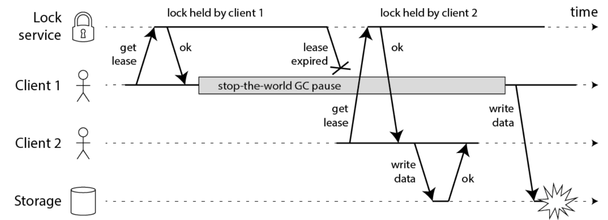
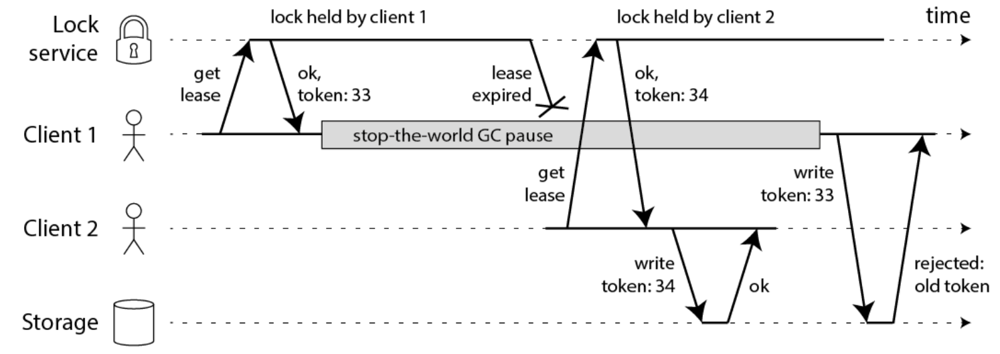

下面有一个简单的使用锁的例子，在10秒内占着锁：

```shell
  //写数据到文件
function writeData(filename, data) {
    boolean locked = lock.tryLock(10, TimeUnit.SECONDS);
    if (!locked) {
        throw 'Failed to acquire lock';
    }

    try {
        //将数据写到文件
        var file = storage.readFile(filename);
        var updated = updateContents(file, data);
        storage.writeFile(filename, updated);
    } finally {
        lock.unlock();
    }
}
```

问题是：如果在写文件过程中，发生了 `fullGC`，并且其时间跨度较长， 超过了10秒， 那么，分布式就自动释放了。

* 在此过程中，`client2` 抢到锁，写了文件。
* `client1` 的`fullGC`完成后，也继续写文件，注意，此时 `client1` 的并没有占用锁，此时写入会导致文件数据错乱，发生线程安全问题。

这就是STW导致的锁过期问题。

STW导致的锁过期问题，具体如下图所示：




STW导致的锁过期问题,大概的解决方案，有：

1. 模拟CAS乐观锁的方式，增加版本号

2. `watch dog`自动延期机制


## 基于CAS

模拟CAS乐观锁的方式，增加版本号（如下图中的`token`）



此方案如果要实现，需要调整业务逻辑，与之配合，所以会入侵代码。

## 基于watch dog自动延期机制

客户端1加锁的锁key默认生存时间才30秒，如果超过了30秒，客户端1还想一直持有这把锁，怎么办呢？

简单！只要客户端1一旦加锁成功，就会启动一个`watch dog`看门狗，他是一个后台线程，会每隔10秒检查一下，如果客户端1还持有锁key，那么就会不断的延长锁key的生存时间。

`redission`，采用的就是这种方案， 此方案不会入侵业务代码。

注意：

* 单机版的 `watch dog` 并不能解决 `STW` 的过期问题， 需要分布式版本的 `watch dog`， 独立的看门狗服务。

* 锁删除之后， 取消看门狗服务的对应的key记录， 当然，这就使得系统变得复杂，还要保证看门狗服务的高并发、高可用、数据一致性的问题。

## 为啥推荐使用Redission

作为 Java 开发人员，我们若想在程序中集成 Redis，必须使用 Redis 的第三方库。目前大家使用的最多的第三方库是jedis。

和`SpringCloud gateway`一样，`Redisson`也是基于`Netty`实现的，是更高性能的第三方库。 所以，这里推荐大家使用`Redisson`替代`jedis`。