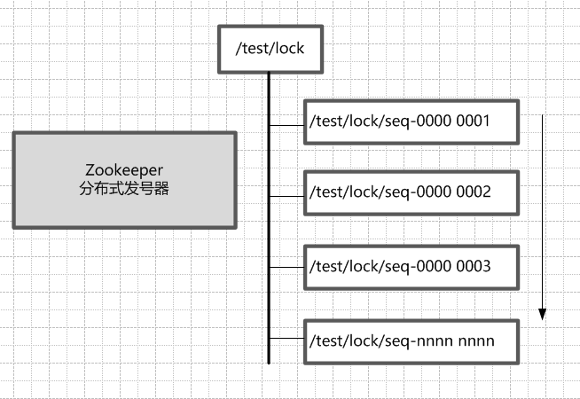

理解了经典的公平可重入锁的原理后，再来看在分布式场景下的公平可重入锁的原理。通过前面的分析，基本可以判定：**ZooKeeper的临时顺序节点，天生就有一副实现分布式锁的胚子**。为什么呢？

**（一） ZooKeeper的每一个节点，都是一个天然的顺序发号器。**

在每一个节点下面创建临时顺序节点（`EPHEMERAL_SEQUENTIAL`）类型，新的子节点后面，会加上一个次序编号，而这个生成的次序编号，是上一个生成的次序编号加一。

例如，有一个用于发号的节点`“/test/lock”`为父亲节点，可以在这个父节点下面创建相同前缀的临时顺序子节点，假定相同的前缀为`“/test/lock/seq-”`。
第一个创建的子节点基本上应该为`/test/lock/seq-0000000000`，下一个节点则为`/test/lock/seq-0000000001`，依次类推，如果所示。

**（二） ZooKeeper节点的递增有序性，可以确保锁的公平**

一个ZooKeeper分布式锁，首先需要创建一个父节点，尽量是持久节点（`PERSISTENT`类型），然后每个要获得锁的线程，都在这个节点下创建个临时顺序节点。由于ZK节点，是按照创建的次序，依次递增的。

为了确保公平，可以简单的规定：编号最小的那个节点，表示获得了锁。所以，每个线程在尝试占用锁之前，首先判断自己是排号是不是当前最小，如果是，则获取锁。

**（三）ZooKeeper的节点监听机制，可以保障占有锁的传递有序而且高效**

每个线程抢占锁之前，先尝试创建自己的`ZNode`。同样，释放锁的时候，就需要删除创建的`ZNode`。创建成功后，如果不是排号最小的节点，就处于等待通知的状态。等谁的通知呢？不需要其他人，只需要等前一个`ZNode`
的通知就可以了。前一个`ZNode`删除的时候，会触发`ZNode`事件，当前节点能监听到删除事件，就是轮到了自己占有锁的时候。第一个通知第二个、第二个通知第三个，击鼓传花似的依次向后。

ZooKeeper的节点监听机制，能够非常完美地实现这种击鼓传花似的信息传递。具体的方法是，每一个等通知的`ZNode`节点，只需要监听（`listen`）或者监视（`watch`）排号在自己前面那个，
而且紧挨在自己前面的那个节点，就能收到其删除事件了。只要上一个节点被删除了，就进行再一次判断，看看自己是不是序号最小的那个节点，如果是，自己就获得锁。

另外，ZooKeeper的内部优越的机制，能保证由于网络异常或者其他原因，集群中占用锁的客户端失联时，锁能够被有效释放。一旦占用`ZNode`锁的客户端与ZooKeeper集群服务器失去联系，
这个临时`ZNode`也将自动删除。排在它后面的那个节点，也能收到删除事件，从而获得锁。正是由于这个原因，在创建取号节点的时候，尽量创建临时`ZNode`节点，

**（四）ZooKeeper的节点监听机制，能避免羊群效应**

ZooKeeper这种首尾相接，后面监听前面的方式，可以避免羊群效应。所谓羊群效应就是一个节点挂掉，所有节点都去监听，然后做出反应，这样会给服务器带来巨大压力，所以有了临时顺序节点，
当一个节点挂掉，只有它后面的那一个节点才做出反应。