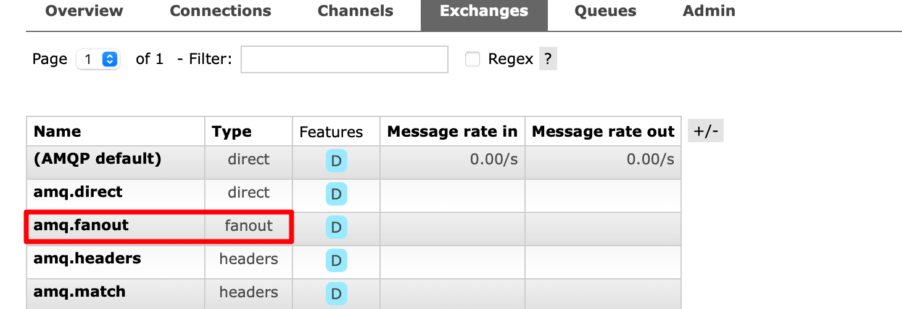
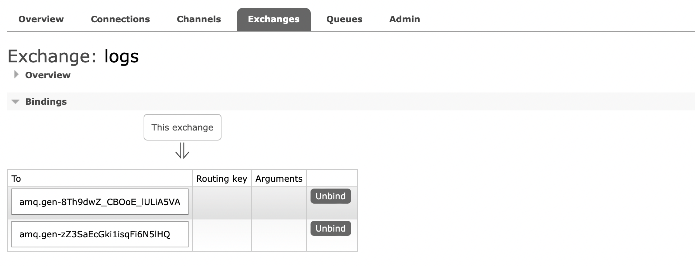

接下来我们来通过代码实战，来看看 `fanout` 交换机的实现效果，我们要实现的示意图如下所示：


有一个生产者，一个`fanout`模式的交换机绑定了两个临时队列，然后分别对应了两个消费者。

**生产者：**

```java
package mode2_WorkQueues.exchange;

import com.rabbitmq.client.BuiltinExchangeType;
import com.rabbitmq.client.Channel;

// 生产者
public class Producer {
    public static void main(String[] args) throws Exception {
        // 创建channel
        Channel channel = utils.RabbitMqUtils.getChannel();
        // 声明交换机
        channel.exchangeDeclare("logs", BuiltinExchangeType.FANOUT);
        // 发送10条消息
        for (int i = 0; i < 10; i++) {
            String message = i + "";
            channel.basicPublish("logs", "", null, message.getBytes());
            System.out.println("消息发送完毕" + message);
        }
    }
}
```

**消费者1：**

```java
package mode2_WorkQueues.exchange;

import com.rabbitmq.client.BuiltinExchangeType;
import com.rabbitmq.client.CancelCallback;
import com.rabbitmq.client.Channel;
import com.rabbitmq.client.DeliverCallback;

// 消费者1
public class Consumer01 {
    public static void main(String[] args) throws Exception {
        // 创建channel
        Channel channel = utils.RabbitMqUtils.getChannel();
        // 声明交换机
        channel.exchangeDeclare("logs", BuiltinExchangeType.FANOUT);
        // 声明临时队列
        String queueName = channel.queueDeclare().getQueue();
        // 绑定队列与交换机
        channel.queueBind(queueName, "logs", "");
        // 消费消息
        DeliverCallback deliverCallback = (consumerTag, message) -> {
            System.out.println("获得消息:" + new String(message.getBody()));
        };
        CancelCallback cancelCallback = (consumerTag) -> {
            System.out.println("消息消费被中断");
        };
        channel.basicConsume(queueName, true, deliverCallback, cancelCallback);
    }
}
```

**消费者2：**

```java
package mode2_WorkQueues.exchange;

import com.rabbitmq.client.BuiltinExchangeType;
import com.rabbitmq.client.CancelCallback;
import com.rabbitmq.client.Channel;
import com.rabbitmq.client.DeliverCallback;

// 消费者2
public class Consumer02 {
    public static void main(String[] args) throws Exception {
        // 创建channel
        Channel channel = utils.RabbitMqUtils.getChannel();
        // 声明交换机
        channel.exchangeDeclare("logs", BuiltinExchangeType.FANOUT);
        // 声明临时队列
        String queueName = channel.queueDeclare().getQueue();
        // 绑定队列与交换机
        channel.queueBind(queueName, "logs", "");
        // 消费消息
        DeliverCallback deliverCallback = (consumerTag, message) -> {
            System.out.println("获得消息:" + new String(message.getBody()));
        };
        CancelCallback cancelCallback = (consumerTag) -> {
            System.out.println("消息消费被中断");
        };
        channel.basicConsume(queueName, true, deliverCallback, cancelCallback);
    }
}
```

然后运行测试，分别启动`consumer01`、`consumer02`，然后启动`producer`发送10条消息


根据终端打印结果可以看到`consumer01`和`consumer02`都收到了这10条消息，因此`fanout`类型的交换机就起到一个广播的作用。

