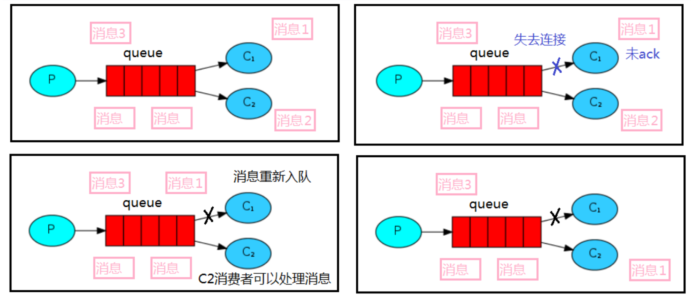

:::tip
默认情况下，`RabbitMQ` 一旦向消费者发送了一条消息后，便立即将该消息标记为删除。由于消费者处理一个消息可能需要一段时间，假如在处理消息中途消费者挂掉了，我们会丢失其正在处理的消息以及后续发送给该消费这的消息。

为了保证消息在发送过程中不丢失，`RabbitMQ` 引入消息应答机制，消息应答意思就是：**消费者在接收消息并且处理完该消息之后，才告知 RabbitMQ 可以把该消息删除了。**

`RabbitMQ` 中消息应答方式有两种：**自动应答（默认）**、**手动应答**
:::

RabbitMQ 中消息应答通过以下方法来实现：

```java
// 肯定确认
void basicAck(long deliveryTag, boolean multiple)

// 否定确认
void basicNack(long deliveryTag, boolean multiple, boolean requeue)
void basicReject(long deliveryTag, boolean requeue)
```

其中：`deliveryTag`表示消息的标志，`multiple`表示是否为批量应答（`ture` 代表批量应答`channel`上未应答的消息，比如当前`channel`上有传送`tag`为`5678`的消息，如果应答时`tag=8`，
则`5～8`的这些还未应答的消息都会被确认收到消息应答；如果为 `false` 则此时只会应答`tag=8`的消息，`567`的消息不会被应答）


## 自动应答

自动应答即消息发送后立即被认为已经传送成功，也就是RabbitMQ默认采用的消息应答方式。**这种模式需要在高吞吐量和数据传输安全性方面做权衡**，因为该模式下如果消息在被接收之前，
消费者的 `connection` 或者 `channel` 关闭，消息就丢失了。此外，由于消费者没有对传递的消息数量进行限制，发送方可以传递过载的消息，可能会造成消费者这边由于接收太多消息来不及处理，
导致这些消息的积压，使得内存耗尽，最终使得这些消费者线程被操作系统杀死。

**所以这种模式仅适用在消费者可以高效并以某种速率能够处理这些消息的情况下使用。**

## 手动应答

采用手动应答后的**消息自动重新入队**可以避免自动应答中消息丢失的情况。如果消费者由于某些原因失去连接(其通道已关闭，连接已关闭或 TCP 连接丢失)，导致消息未发送 ACK 确认，
RabbitMQ 将了解到消息未完全处理，并将对其重新排队。如果此时其他消费者可以处理，它将很快将其重新分发给另一个消费者。这样，即使某个消费者偶尔死亡，也可以确保不会丢失任何消息。



## 代码实现

只需要对上述 `Work Queues` 示例代码作出简单修改：

### 生产者Producer

```java
package mode2_WorkQueues.ack;

import com.rabbitmq.client.Channel;

import java.util.Scanner;

public class Producer {
    public static String QUEUE_NAME = "ack";

    public static void main(String[] args) throws Exception {
        // 创建channel
        Channel channel = utils.RabbitMqUtils.getChannel();
      	// 声明队列
     		channel.queueDeclare(QUEUE_NAME, false, false, false, null);
        // 发送消息
        Scanner scanner = new Scanner(System.in);
        while (scanner.hasNext()) {
            String message = scanner.next();
            channel.basicPublish("", QUEUE_NAME, null, message.getBytes());
            System.out.println("消息发送完毕" + message);
        }
    }
}
```

### 消费者Consumer01

其中消费消息的回调接口中我们模拟了接收消息的延迟为1s

```java
package mode2_WorkQueues.ack;

import com.rabbitmq.client.CancelCallback;
import com.rabbitmq.client.Channel;
import com.rabbitmq.client.DeliverCallback;

// 测试手动应答
public class Consumer01 {
    public static String QUEUE_NAME = "ack";

    public static void main(String[] args) throws Exception {
        // 创建channel
        Channel channel = utils.RabbitMqUtils.getChannel();
        System.out.println("consumer1收到消息时间较短");
        // 消费消息的回调
        DeliverCallback deliverCallback = (consumerTag, message) -> {
            // 模拟接受消息的延迟 1s
            try {
                Thread.sleep(1000 * 1);
            } catch (InterruptedException e) {
                e.printStackTrace();
            }
            System.out.println("消息成功消费!内容为:" + new String(message.getBody()));
            // 手动应答:第一个参数表示消息标记tag、第二个参数false表示不进行批量应答
            channel.basicAck(message.getEnvelope().getDeliveryTag(), false);
        };
        // 取消消费的回调
        CancelCallback cancelCallback = (consumerTag) -> {
            System.out.println("消息消费被中断");
        };
      	// 消费消息（第2个参数修改为false表示手动应答）
        channel.basicConsume(QUEUE_NAME, false, deliverCallback, cancelCallback);
    }
}
```

### 消费者Consumer02

其中消费消息的回调接口中我们模拟了接收消息的延迟为10s

```java
package mode2_WorkQueues.ack;

import com.rabbitmq.client.CancelCallback;
import com.rabbitmq.client.Channel;
import com.rabbitmq.client.DeliverCallback;

// 测试手动应答
public class Consumer02 {
    public static String QUEUE_NAME = "ack";

    public static void main(String[] args) throws Exception {
        // 创建channel
        Channel channel = utils.RabbitMqUtils.getChannel();
        System.out.println("consumer2收到消息时间较长");
      	// 消费消息的回调
        DeliverCallback deliverCallback = (consumerTag, message) -> {
            // 模拟接受消息的延迟 10s
            try {
                Thread.sleep(1000 * 10);
            } catch (InterruptedException e) {
                e.printStackTrace();
            }
            System.out.println("消息成功消费!内容为:" + new String(message.getBody()));
            // 手动应答:第一个参数表示消息标记tag、第二个参数false表示不进行批量应答
            channel.basicAck(message.getEnvelope().getDeliveryTag(), false);
        };
      	// 取消消费的回调
        CancelCallback cancelCallback = (consumerTag) -> {
            System.out.println("消息消费被中断");
        };
        // 消费消息（第2个参数修改为false表示手动应答）
        channel.basicConsume(QUEUE_NAME, false, deliverCallback, cancelCallback);
    }
}
```

### 测试

首先启动生产者`producer`，然后启动两个消费者`consumer01`和`consumer02`。然后通过`producer`发送4条消息：


* 由于`consumer01`消费时间只有1s，因此可以立马看到`consumer01`根据轮询的规则收到了1、3消息


* 按照默认的轮询机制，2、4消息由`consumer02`来消费，10s后`consumer2`能正常收到。但此时如果我们停止`Consumer02`线程


* 过一会再看`consumer01`，可以看到它消费了2、4消息


这就是手动应答的消息重新入队机制，我们避免了consumer02停机而造成原本分配给它消息的丢失问题。