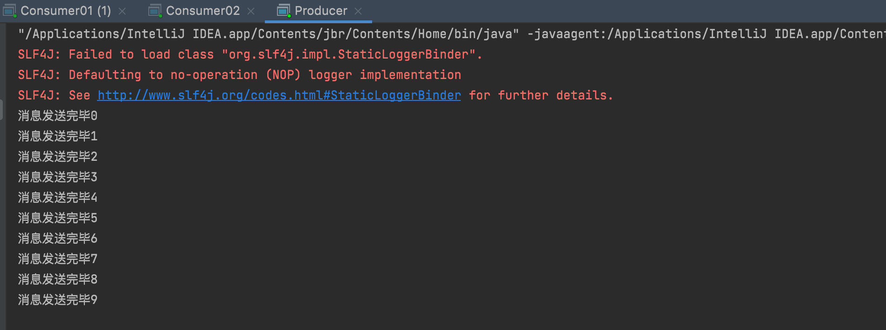
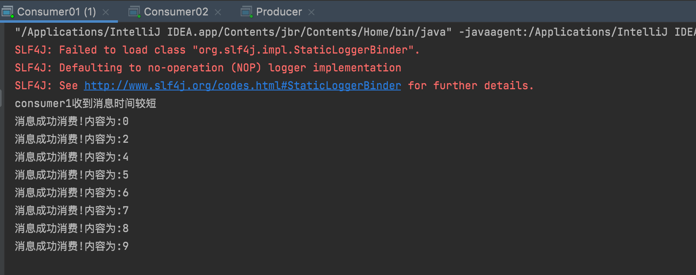

本身消息的发送就是异步发送的，所以在任何时候，`channel` 上肯定不止只有一个消息另外来自消费者的手动确认本质上也是异步的。因此这里就存在一个未确认的消息缓冲区，
所以希望开发人员能**限制此缓冲区的大小，以避免缓冲区里面无限制的未确认消息问题。**

这个时候就可以通过使用 `basic.qos` 方法设置`“预取计数”`值来完成。**该值定义通道上允许的未确认消息的最大数量**。一旦数量达到配置的数量，RabbitMQ 将停止在通道上传递更多消息，
除非至少有一个未处理的消息被确认。假设在通道上有未确认的消息 `5`、`6`、`7`，`8`，并且通道的预取计数设置为 `4`，此时 RabbitMQ 将不会在该通道上再传递任何消息，
除非至少有一个未应答的消息被 `ack`。比方说 `tag=6` 的消息刚刚被确认 `ACK`，RabbitMQ 将会感知这个情况到并再发送一条消息。

消息应答和 `QoS` 预取值对用户吞吐量有重大影响。通常增加预取将提高向消费者传递消息的速度，**虽然自动应答传输消息速率是最佳的，但是在这种情况下已传递但尚未处理的消息的数量也会增加，
从而增加了消费者的RAM消耗**。

我们应该小心使用具有无限预处理的自动确认模式或采用手动确认模式，消费者消费了大量的消息如果没有确认的话，会导致消费者连接节点的内存消耗变大，所以找到合适的预取值是一个反复试验的过程，
不同的负载该值取值也不同 100 到 300 范围内的值通常可提供最佳的吞吐量，并且不会给消费者带来太大的风险。预取值为 1 是最保守的。当然这将使吞吐量变得很低，特别是消费者连接延迟很严重的情况下，
特别是在消费者连接等待时间较长的环境中。对于大多数应用来说，稍微高一点的值将是最佳的。


## 代码示例

编写两个消费者`consumer01`和`consumer02`，预取值分别为5和2。然后编写一个消费者发送7条消息

### consumer01

预取值5，模拟接受消息延迟1s

```java
package mode2_WorkQueues.ack;

import com.rabbitmq.client.CancelCallback;
import com.rabbitmq.client.Channel;
import com.rabbitmq.client.DeliverCallback;

// 测试手动应答
public class Consumer01 {
    public static String QUEUE_NAME = "prefetch";

    public static void main(String[] args) throws Exception {
        // 创建channel
        Channel channel = utils.RabbitMqUtils.getChannel();
        System.out.println("consumer1收到消息时间较短");
        // 设置预取值5
        channel.basicQos(5);
        // 消费消息（第2个参数修改为false表示手动应答）
        DeliverCallback deliverCallback = (consumerTag, message) -> {
            // 模拟接受消息的延迟 10s
            try {
                Thread.sleep(1000 * 1);
            } catch (InterruptedException e) {
                e.printStackTrace();
            }
            System.out.println("消息成功消费!内容为:" + new String(message.getBody()));
            // 手动应答:第一个参数表示消息标记tag、第二个参数false表示不进行批量应答
            channel.basicAck(message.getEnvelope().getDeliveryTag(), false);
        };
        CancelCallback cancelCallback = (consumerTag) -> {
            System.out.println("消息消费被中断");
        };
        channel.basicConsume(QUEUE_NAME, false, deliverCallback, cancelCallback);
    }
}
```

### consumer02

预取值2，模拟接受消息延迟10s

```java
package mode2_WorkQueues.ack;

import com.rabbitmq.client.CancelCallback;
import com.rabbitmq.client.Channel;
import com.rabbitmq.client.DeliverCallback;

// 测试手动应答
public class Consumer02 {
    public static String QUEUE_NAME = "prefetch";

    public static void main(String[] args) throws Exception {
        // 创建channel
        Channel channel = utils.RabbitMqUtils.getChannel();
        System.out.println("consumer2收到消息时间较长");
        // 设置预取值2
        channel.basicQos(2);
        // 消费消息（第2个参数修改为false表示手动应答）
        DeliverCallback deliverCallback = (consumerTag, message) -> {
            // 模拟接受消息的延迟 1s
            try {
                Thread.sleep(1000 * 10);
            } catch (InterruptedException e) {
                e.printStackTrace();
            }
            System.out.println("消息成功消费!内容为:" + new String(message.getBody()));
            // 手动应答:第一个参数表示消息标记tag、第二个参数false表示不进行批量应答
            channel.basicAck(message.getEnvelope().getDeliveryTag(), false);
        };
        CancelCallback cancelCallback = (consumerTag) -> {
            System.out.println("消息消费被中断");
        };
        channel.basicConsume(QUEUE_NAME, false, deliverCallback, cancelCallback);
    }
}
```

### 生产者

发送10条消息

```java
package mode2_WorkQueues.ack;

import com.rabbitmq.client.Channel;

public class Producer {
    public static String QUEUE_NAME = "prefetch";

    public static void main(String[] args) throws Exception {
        // 创建channel
        Channel channel = utils.RabbitMqUtils.getChannel();
        // 发送消息
        channel.queueDeclare(QUEUE_NAME, false, false, false, null);
        for (int i = 0; i < 10; i++) {
            String message = i + "";
            channel.basicPublish("", QUEUE_NAME, null, message.getBytes());
            System.out.println("消息发送完毕" + message);
        }
    }
}
```

启动消费者发送10条消息，前7条消息按照预取值的设定应该分给5条给`consumer01`，2条给`consumer02`



由于`consumer01`处理速度较快，`consumer02`处理较慢，所以`consumer01`处理完5条消息时`consumer02`还未处理第一条消息，因此后面的`8`、`9`、`10`条消息都会分配给`consumer01`进行消费。

对比以下结果，与我们设想的相同：



