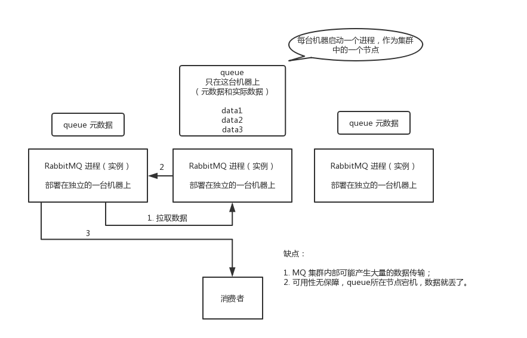
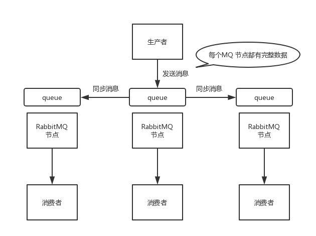
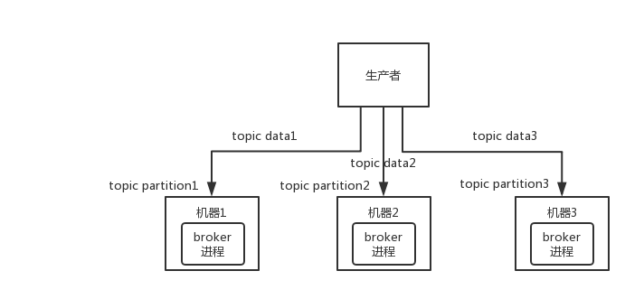
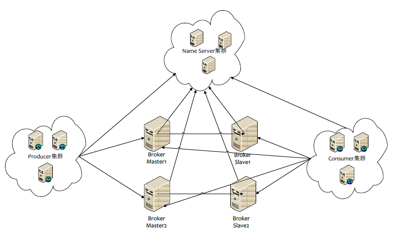

## 一、 可用性评估

系统可用性(`Availability`)是信息工业界用来衡量一个信息系统提供持续服务的能力，它表示的是在给定时间区间内系统或者系统某一能力在特定环境中能够正常工作的概率。

简单地说， 可用性是平均故障间隔时间(`MTBF`)除以平均故障间隔时间(`MTBF`)和平均故障修复时间(`MTTR`)之和所得的结果， 即：


通常业界习惯用`N`个`9`来表征系统可用性，表示系统可以正常使用时间与总时间(1年)之比，比如：

* `99.9%`代表`3`个`9`的可用性，意味着全年不可用时间在`8.76`小时以内，表示该系统在连续运行1年时间里最多可能的业务中断时间是`8.76`小时；
* `99.99%`代表`4`个`9`的可用性，意味着全年不可用时间在`52.6`分钟以内,表示该系统在连续运行1年时间里最多可能的业务中断时间是`52.6`分钟；
* `99.999%`代表`5`个`9`的可用性，意味着全年不可用时间必须保证在`5.26`分钟以内，缺少故障自动恢复机制的系统将很难达到`5`个`9`的高可用性。

我们接着往下计算：

```java
1个9：(1-90%)*365=36.5天 

*2个9：(1-99%)*365=3.65天 

6个9：(1-99.9999%)*365*24*60*60=31秒
```

可以看到`1个9`和、`2个9`分别表示一年时间内业务可能中断的时间是`36.5`天、`3.65`天，这种级别的可靠性或许还不配使用“可靠性”这个词；

而`6个9`则表示一年内业务中断时间最多是`31`秒，那么这个级别的可靠性并非实现不了，而是要做到从`“5个9”` 到`“6个9”`的可靠性提升的话，后者需要付出比前者几倍的成本。

## 二、 RabbitMQ 的高可用性

`RabbitMQ` 是比较有代表性的，因为是基于主从（非分布式）做高可用性的，我们就以 `RabbitMQ` 为例子讲解第一种 `MQ` 的高可用性怎么实现。

`RabbitMQ` 有三种模式：`单机模式`、`普通集群模式`、`镜像集群模式`。

### 2.1、单机模式

单机模式，就是 `Demo` 级别的，一般就是你本地启动了玩玩儿的，没人生产用单机模式。

### 2.2、普通集群模式（无高可用性）

普通集群模式，意思就是在多台机器上启动多个 `RabbitMQ` 实例，每台机器启动一个。你创建的 `queue`，只会放在一个 `RabbitMQ` 实例上，但是每个实例都同步 `queue` 的元数据（元数据可以认为是 `queue` 的一些配置信息，通过元数据，可以找到 `queue` 所在实例）。
你消费的时候，实际上如果连接到了另外一个实例，那么那个实例会从 `queue` 所在实例上拉取数据过来。



这种方式确实很麻烦，也不怎么好，没做到所谓的分布式，就是个普通集群。因为这导致你要么消费者每次随机连接一个实例然后拉取数据，要么固定连接那个 `queue` 所在实例消费数据，前者有数据拉取的开销，后者导致单实例性能瓶颈。

而且如果那个放 `queue` 的实例宕机了，会导致接下来其他实例就无法从那个实例拉取，如果你开启了消息持久化，让 `RabbitMQ` 落地存储消息的话，消息不一定会丢，得等这个实例恢复了，然后才可以继续从这个 `queue` 拉取数据。

所以这个事儿就比较尴尬了，这就没有什么所谓的高可用性，这方案主要是提高吞吐量的，就是说让集群中多个节点来服务某个 `queue` 的读写操作。

### 2.3、镜像集群模式（高可用性）

这种模式，才是所谓的 `RabbitMQ` 的高可用模式。跟普通集群模式不一样的是，在镜像集群模式下，你创建的 `queue`，无论是元数据还是 `queue` 里的消息都会存在于多个实例上，就是说，每个 `RabbitMQ` 节点都有这个 `queue` 的一个**完整镜像**，
包含 `queue` 的全部数据的意思。然后每次你写消息到 `queue` 的时候，都会自动把消息同步到多个实例的 `queue` 上。



那么如何开启这个镜像集群模式呢？其实很简单，`RabbitMQ` 有很好的管理控制台，就是在后台新增一个策略，这个策略是镜像集群模式的策略，指定的时候是可以要求数据同步到所有节点的，也可以要求同步到指定数量的节点，再次创建 `queue` 的时候，应用这个策略，
就会自动将数据同步到其他的节点上去了。

这样的话，好处在于，你任何一个机器宕机了，没事儿，其它机器（节点）还包含了这个 `queue` 的完整数据，别的 `consumer` 都可以到其它节点上去消费数据。坏处在于，第一，这个性能开销也太大了吧，消息需要同步到所有机器上，导致网络带宽压力和消耗很重！
第二，这么玩儿，不是分布式的，就没有扩展性可言了，如果某个 `queue` 负载很重，你加机器，新增的机器也包含了这个 `queue` 的所有数据，并没有办法线性扩展你的 `queue`。你想，如果这个 `queue` 的数据量很大，大到这个机器上的容量无法容纳了，此时该怎么办呢？

## 三、 Kafka 的高可用性

`Kafka` 一个最基本的架构认识：由多个 `broker` 组成，每个 `broker` 是一个节点；你创建一个 `topic`，这个 `topic` 可以划分为多个 `partition`，每个 `partition` 可以存在于不同的 `broker` 上，每个 `partition` 就放一部分数据。

这就是天然的分布式消息队列，就是说一个 `topic` 的数据，是分散放在多个机器上的，每个机器就放一部分数据。

实际上 `RabbitMQ` 之类的，并不是分布式消息队列，它就是传统的消息队列，只不过提供了一些`集群`、`HA(High Availability, 高可用性)` 的机制而已，因为无论怎么玩儿，`RabbitMQ` 一个 `queue` 的数据都是放在一个节点里的，镜像集群模式下，
也是每个节点都放这个 `queue` 的完整数据。

`Kafka 0.8` 以前，是没有 `HA` 机制的，就是任何一个 `broker` 宕机了，那个 `broker` 上的 `partition` 就废了，没法写也没法读，没有什么高可用性可言。

比如说，我们假设创建了一个 `topic`，指定其 `partition` 数量是 `3` 个，分别在三台机器上。但是，如果第二台机器宕机了，会导致这个 `topic` 的 `1/3` 的数据就丢了，因此这个是做不到高可用的。



`Kafka 0.8` 以后，提供了 `HA` 机制，就是 `replica`（复制品） 副本机制。每个 `partition` 的数据都会同步到其它机器上，形成自己的多个 `replica` 副本。所有 `replica` 会选举一个 `leader` 出来，那么生产和消费都跟这个 `leader` 打交道，
然后其他 `replica` 就是 `follower`。写的时候，`leader` 会负责把数据同步到所有 `follower` 上去，读的时候就直接读 `leader` 上的数据即可。只能读写 `leader`？很简单，**要是你可以随意读写每个 `follower`，那么就要 `care` 数据一致性的问题**，
系统复杂度太高，很容易出问题。`Kafka` 会均匀地将一个 `partition` 的所有 `replica` 分布在不同的机器上，这样才可以提高容错性。


这么搞，就有所谓的高可用性了，因为如果某个 `broker` 宕机了，没事儿，那个 `broker` 上面的 `partition` 在其他机器上都有副本的。如果这个宕机的 `broker` 上面有某个 `partition` 的 `leader`，那么此时会从 `follower` 中重新选举一个新的 `leader` 出来，
大家继续读写那个新的 `leader` 即可。这就有所谓的高可用性了。

写数据的时候，生产者就写 `leader`，然后 `leader` 将数据落地写本地磁盘，接着其他 `follower` 自己主动从 `leader` 来 `pull` 数据。一旦所有 `follower` 同步好数据了，就会发送 `ack` 给 `leader`，`leader` 收到所有 `follower` 的 `ack` 之后，
就会返回写成功的消息给生产者。（当然，这只是其中一种模式，还可以适当调整这个行为）

消费的时候，只会从 `leader` 去读，但是只有当一个消息已经被所有 `follower` 都同步成功返回 `ack` 的时候，这个消息才会被消费者读到。

看到这里，相信你大致明白了 `Kafka` 是如何保证高可用机制的了，对吧？不至于一无所知，现场还能给面试官画画图。要是遇上面试官确实是 `Kafka` 高手，深挖了问，那你只能说不好意思，太深入的你没研究过。

## 四、 RocketMQ 高可用

`RocketMQ`的`Broker`有三种集群部署方式：

* 1.单台Master部署；
* 2.多台Master部署；
* 3.多Master多Slave部署；

采用第3种部署方式时，`Master`和`Slave`可以采用`同步复制`和`异步复制`两种方式。

下图是第3种部署方式的简单图：



### 4.1、单台Master部署

也就是只有一个 `master` 节点，如果`master`节点挂掉了，会导致整个服务不可用，线上不宜使用，适合个人学习使用。

### 4.2、多台Master部署

多个 `master` 节点组成集群，单个 `master` 节点宕机或者重启对应用没有影响。 优点：所有模式中性能最高 缺点：单个 `master` 节点宕机期间，未被消费的消息在节点恢复之前不可用，
消息的实时性就受到影响。 注意：使用同步刷盘可以保证消息不丢失，同时 `Topic` 相对应的 `queue` 应该分布在集群中各个 `master` 节点，而不是只在某各 `master` 节点上，
否则，该节点宕机会对订阅该 `topic` 的应用造成影响。

### 4.3、多Master多Slave部署

#### ① 多 master 多 slave 异步复制模式

在多 `master` 模式的基础上，每个 `master` 节点都有至少一个对应的 `slave`。

`master` 节点可读可写，但是 `slave` 只能读不能写，类似于 `mysql` 的主备模式。

* **优点**： 在 `master` 宕机时，消费者可以从 `slave` 读取消息，消息的实时性不会受影响，性能几乎和多 `master` 一样。
* **缺点**：使用异步复制的同步方式有可能会有消息丢失的问题。

#### ② 多 master 多 slave 同步复制模式

同多 `master` 多 `slave` 异步复制模式类似，区别在于 `master` 和 `slave` 之间的数据同步方式。 

* **优点**：同步双写的同步模式能保证数据不丢失。 
* **缺点**：发送单个消息 `RT` 会略长，性能相比异步复制低`10%`左右。 

* **刷盘策略**：同步刷盘和异步刷盘（指的是节点自身数据是同步还是异步存储） 注意：要保证数据可靠，需采用同步刷盘和同步双写的方式，但性能会较其他方式低。