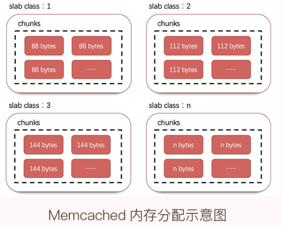

# 06丨面试现场第 1 期：当问到组件实现原理时，面试官是在刁难你吗？

今天是我们面试现场的第 1 期，我想跟你探讨的话题是：当面试官问你某某组件的实现原理是什么时，他究竟想了解什么？你又需要了解到什么层面上呢?

经历过面试的你一定知道，社招岗位的面试里一定会包含项目经历介绍的。面试官会问及一些特定场景下实现方案的设计，还会问你一些基础知识和基本算法。而在考察基础知识时，你一定被面试官追问过，某某组件的实现原理是什么。

那么，**对于仅仅使用组件的开发人员来说，了解组件的实现原理真的很重要吗？这会不会是面试官的故意刁难呢?** 在回答这些问题之，我先跟你分享一下我面试候选人的经历。

当时，候选人已有五年的工作经验，虽然没什么大厂工作经历,但是从简历来看，他对于互联网领域常见的一些组件，比如 Redis、MSQL、 Dubbo、 Spring Boot 等都有比较深入的了解。这对于求贤若渴的我们来说无疑有着巨大的吸引力，于是邀约了面试。面试过程中，候选人对项目整体的把控不错，对项目中的问题以及项目未来的发展思路都有一定的见解。可是当我问及一些基础的知识以及用过的一些组件时，出现了问题

- 你为什么会在项目里使用 Redis 呢？又是如何使用的呢？

  当时，我们发现项目中某些读取接口有一些性能上的问题，所以会使用 Redis 作为缓存提升读取性能…….还
  使用 Redis 做一些数据持久化存储，两者的使用规范是….后面发现在扩展性上存在问题，我们又调研了 Redis
  Cluste 和 Codis

- 使用 Redis时，你用了哪些数据结构呢

  基本的数据结构都有使用，比较常用除了 Key-vaue 以外还有 Hash 和 SortedSet

- 请简单介绍一些 SortedSet 使用的数据结构。
  
  这个不太了解。
-    那 SortedSet 是一种排序列表，如果 由你来实现的话，你会怎么实现呢？
  
  嗯……可以用红黑树。
-   那红黑树的原理是怎样的呢？

  是这样的…… blablablabla 的
-  那你听说过跳表吗？
  
  听说过,它的原理是这样的….
-  那你觉得 Redis 的 SortedSet 结构是使用红黑树好，还是使用跳表好呢？

其实你可以看到，Redis 作为高并发场景下经常使用到的组件，虽然我们仅仅只是使用它，但面试官在询问你，它的内部原理时，是想了解组件中使用的基本数据结构、算法以及设计思想你是否真正地了解和掌握。也就是说，他并不是在故意刁难你，而是在考察你的基础知识是否扎实。

再举一个例子，Java面试中经常被问到的个数据结构就是 HashMap，毫不夸张地说，十个 Java 面试中有八个会问到 Hash Map，比如我就会问到这么几个问题：

- HashMap 实现的底层数据结构是怎样的?
- 如果发生 Hash 冲突，要怎么解决？常见的解决方式是怎样的?
- JDK8 中对 Hash Map 做了什么样的优化呢？
- 红黑树的实现原理是怎样的？相比于链表它的优势和劣势都是什么？
- HashMap 是线程安全的吗？
- ConcurrentHashMap 是如何做到线程安全的呢？

你大可以试着回答一下 ，看看自己对上面几个问题是一知半解呢？还是能全部回答上来呢？

你看，虽然面试官问的是 JDK 中一个类的实现原理，但这里面涉及了数组、链表、红黑树等基本的算法；解决Hash 冲突的基本思路； 并发线程安全的含义，以及解决线程不安全问题的基本思路，并且也可以引出和线程安全相关的一系列问题。

了解了这些基本原理,除了可以夯实你的基础知识以外，还可以为你的方案设计提供思路。比如说，当需要更高效的读写内存中的数据时可以怎么做，遇到并发问题时要如何来解决等等。

最后，也是最重要的，了解了组件的基本原理你在使用这些组件的时候才能够充分发挥它的优点、避免踩坑，在遇到问题的时候也会有排查的思路。

**我跟你分享一个真实案例**。在之前主导的一个项目中，我们使用 Memcached 作为缓存组件来提升数据的读取性能。在使用的过程中，我们发现一个存储用户认证信息的缓存的命中率极低，只有 20%。

因为这个认证信息只有极少数的用户会有，大部分的用户在数据库中是没有这个数据的，所以最初我认为是因为查询数据库的时候，没有査询到数据导致没有设置到缓存，所以每次查询缓存的时候就不会命中。

于是，我增加了「从数据库中查询到空数据后也回中缓存」的逻辑，但是上线之后效果并不明显。这时，我查看了一下 Memcached 节点的统计信息，发现单个节点 2G 的内存空间仅仅被使用了 300M，而且缓存 tem 剔除数非常得高，达到了几十亿。

我们知道 Memcached 内部采用的是名为 Slab Allocator 的机制来分配和管理内存的，主要为了解决內存分配碎片的问题。这种机制会预先分配若干组内存区域，每一组称为一个 slab class，每个 slab class 下的各个内存区域大小是相同的，每个内存区域称之为 chunk

当存储一个数据时，先要看这个数据大小是多少，要存储在哪一个 slab class 下。如果这个 slab class 没有足够的空间了，那么会查找更大的 slab class 直到找到合适的为止。

于是，我考虑是不是因为缓存用户认证信息时没有找到合适的 slab class，才导致数据不断地被剔除出缓存，从而造成缓存命中率低。所以我看了一下 slab 的统计信息，发现 slab class5 占用了 2G 内存中的 1.9G，而用户认证信息会被存放在 slab class6 下，而这个 slab class 的剔除数量非常高。再抓取这个 slab class 下的一小部分数据，发现确实都是用户认证信息数据，此时，我才找到问题的根本原因。

你看，如果不了解 Memcached 的内存分配原理，你可能永远都无法彻底解决这个问题。

所以，在面试的过程中，当你被问到组件的实现原理时，面试官其实想要了解你，是否对于实现原理中涉及的基础知识有足够的了解？在实际开发中，你是否能够运用这些基础知识来设计合理的方案？以及，当这些组件发生问题的时候，你是否有思路解决？

所以，**其实你无需对组件达到源代码级别的了解，只需要深入了解它的实现原理，再结合一些基础知识，如算法、网络、操作系统等等，就足够应对 80% 的面试问题**。

不过，掌握这些知识并不是一朝一夕的，你需要在课下多多用功，查阋相关的资料和书籍。在这里，我提供给你几点想要了解一些基础知识，你可以啃一啃这个领域的经典书籍，比如《算法导论》、《TCPIP 协议详解》、《深入理解计算机系统》等等。

**对于一些开源组件你可以多读一读它们的官方文档，文档上一般会有这个组件的设计思路，架构讲解以及一些细节知识点的介绍，对于一个组件的使用者来说足够了**。

除此之外，一些技术类的博客和公众号也可以多多关注，比如酷壳网、并发编程网、架构师之路等等，这样可以多利用碎片化的时间来学习。

厚积才能薄发，积累得多了，在方案设计和问题排查的时候才会有更多的思路。你在实际工作中，才会更加游刃有余。
