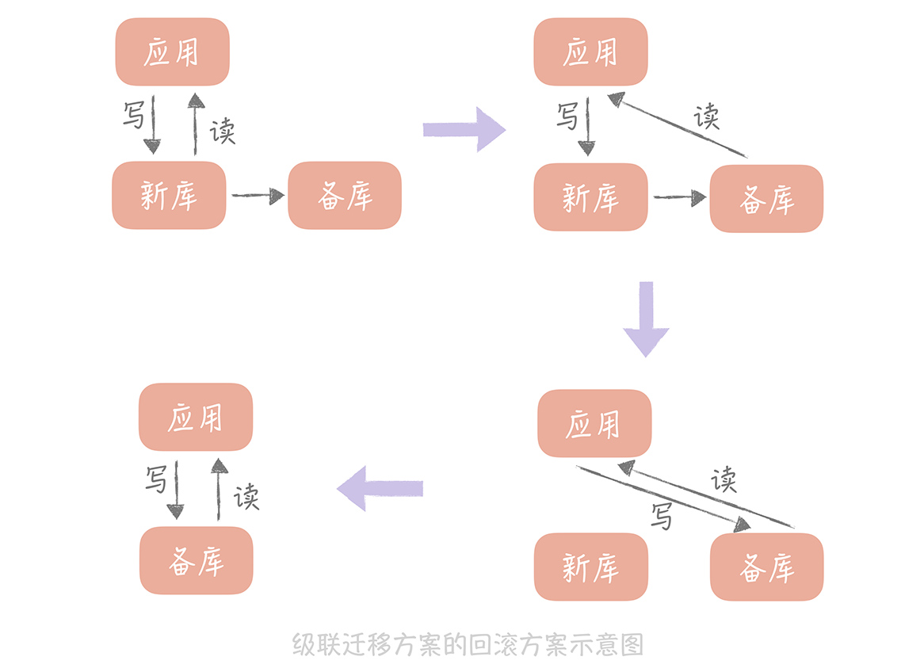
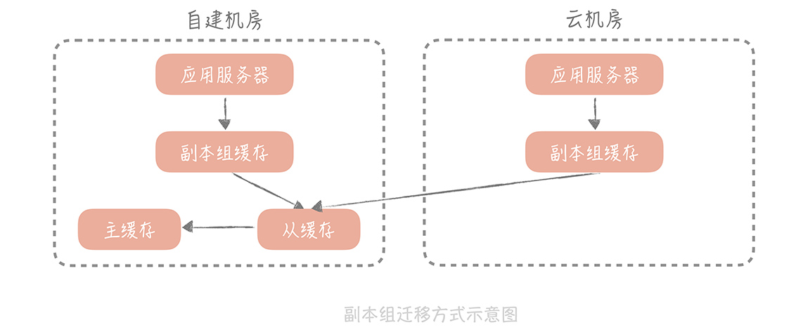

# 加餐丨数据的迁移应该如何做？

由于 MySQL 不像 MongoDB 那样支持数据的 Auto Sharding（自动分片），所以无论是将 MySQL 单库拆分成多个数据库，还是由于数据存储的瓶颈，不得不将多个数据库拆分成更多的数据库时，你都要考虑如何做数据的迁移。

其实，在实际工作中，不只是对数据库拆分时会做数据迁移， **很多场景都需要你给出数据迁移的方案，** 比如说某一天，你的老板想要将应用从自建机房迁移到云上，那么你就要考虑将所有自建机房中的数据，包括 MySQL，Redis，消息队列等组件中的数据，全部迁移到云上，这无论对哪种规模的公司来说都是一项浩瀚的工程，所以你需要在迁移之前，准备完善的迁移方案。

数据的迁移的问题比较重要，也比较繁琐，也是开发和运维同学关注的重点。

## 如何平滑地迁移数据库中的数据

你可能会认为：数据迁移无非是将数据从一个数据库拷贝到另一个数据库，可以通过 MySQL 主从同步的方式做到准实时的数据拷贝；也可以通过 mysqldump 工具将源库的数据导出，再导入到新库，**这有什么复杂的呢？**

其实，这两种方式只能支持单库到单库的迁移，无法支持单库到多库多表的场景。而且即便是单库到单库的迁移，迁移过程也需要满足以下几个目标：

- 迁移应该是在线的迁移，也就是在迁移的同时还会有数据的写入；

- 数据应该保证完整性，也就是说在迁移之后需要保证新的库和旧的库的数据是一致的；

- 迁移的过程需要做到可以回滚，这样一旦迁移的过程中出现问题，可以立刻回滚到源库，不会对系统的可用性造成影响。

如果你使用 Binlog 同步的方式，在同步完成后再修改代码，将主库修改为新的数据库，这样就不满足可回滚的要求，一旦迁移后发现问题，由于已经有增量的数据写入了新库而没有写入旧库，不可能再将数据库改成旧库。

一般来说，我们有两种方案可以做数据库的迁移。

## 双写方案

第一种方案我称之为双写，其实说起来也很简单，它可以分为以下几个步骤：

1. 将新的库配置为源库的从库，用来同步数据；

   如果需要将数据同步到多库多表，那么可以使用一些第三方工具获取 Binlog 的增量日志（比如开源工具 Canal），在获取增量日志之后就可以按照分库分表的逻辑写入到新的库表中了。

2. 同时，我们需要改造业务代码，在数据写入的时候，不仅要写入旧库，也要写入新库。

   当然，基于性能的考虑，我们可以异步地写入新库，只要保证旧库写入成功即可。 **但是，我们需要注意的是，** 需要将写入新库失败的数据记录在单独的日志中，这样方便后续对这些数据补写，保证新库和旧库的数据一致性。

3. 然后，我们就可以开始校验数据了。由于数据库中数据量很大，做全量的数据校验不太现实。你可以抽取部分数据，具体数据量依据总体数据量而定，只要保证这些数据是一致的就可以。

4. 如果一切顺利，我们就可以将读流量切换到新库了。

   由于担心一次切换全量读流量可能会对系统产生未知的影响，所以这里 **最好采用灰度的方式来切换，** 比如开始切换 10% 的流量，如果没有问题再切换到 50% 的流量，最后再切换到 100%。

5. 由于有双写的存在，所以在切换的过程中出现任何的问题，都可以将读写流量随时切换到旧库去，保障系统的性能。

6. 在观察了几天发现数据的迁移没有问题之后，就可以将数据库的双写改造成只写新库，数据的迁移也就完成了。

**其中，最容易出问题的步骤就是数据校验的工作，** 所以，我建议你在未开始迁移数据之前先写好数据校验的工具或者脚本，在测试环境上测试充分之后，再开始正式的数据迁移。

如果是将数据从自建机房迁移到云上，你也可以使用这个方案， **只是你需要考虑的一个重要的因素是：** 自建机房到云上的专线的带宽和延迟，你需要尽量减少跨专线的读操作，所以在切换读流量的时候，你需要保证自建机房的应用服务器读取本机房的数据库，云上的应用服务器读取云上的数据库。这样在完成迁移之前，只要将自建机房的应用服务器停掉，并且将写入流量都切到新库就可以了。

这种方案是一种比较通用的方案，无论是迁移 MySQL 中的数据，还是迁移 Redis 中的数据，甚至迁移消息队列都可以使用这种方式， **你在实际的工作中可以直接拿来使用。**

这种方式的 **好处是：** 迁移的过程可以随时回滚，将迁移的风险降到了最低。 **劣势是：** 时间周期比较长，应用有改造的成本。

## 级联同步方案

这种方案也比较简单，比较适合数据从自建机房向云上迁移的场景。因为迁移上云，最担心云上的环境和自建机房的环境不一致，会导致数据库在云上运行时，因为参数配置或者硬件环境不同出现问题。

所以，我们会在自建机房准备一个备库，在云上环境上准备一个新库，通过级联同步的方式在自建机房留下一个可回滚的数据库，具体的步骤如下：

1. 先将新库配置为旧库的从库，用作数据同步；

2. 再将一个备库配置为新库的从库，用作数据的备份；

3. 等到三个库的写入一致后，将数据库的读流量切换到新库；

4. 然后暂停应用的写入，将业务的写入流量切换到新库（由于这里需要暂停应用的写入，所以需要安排在业务的低峰期）。

**这种方案的回滚方案也比较简单，** 可以先将读流量切换到备库，再暂停应用的写入，将写流量切换到备库，这样所有的流量都切换到了备库，也就是又回到了自建机房的环境，就可以认为已经回滚了。

上面的级联迁移方案可以应用在，将 MySQL 从自建机房迁移到云上的场景，也可以应用在将 Redis 从自建机房迁移到云上的场景， **如果你有类似的需求可以直接拿来应用。** 

这种方案 **优势是** 简单易实施，在业务上基本没有改造的成本；

**缺点是** 在切写的时候需要短暂的停止写入，对于业务来说是有损的，不过如果在业务低峰期来执行切写，可以将对业务的影响降至最低。

## 数据迁移时如何预热缓存

另外，在从自建机房向云上迁移数据时，我们也需要考虑缓存的迁移方案是怎样的。那么你可能会说：缓存本来就是作为一个中间的存储而存在的，我只需要在云上部署一个空的缓存节点，云上的请求也会穿透到云上的数据库，然后回种缓存，对于业务是没有影响的。

你说的没错，但是你还需要考虑的是缓存的命中率。

如果你部署一个空的缓存，那么所有的请求就都穿透到数据库，数据库可能因为承受不了这么大的压力而宕机，这样你的服务就会不可用了。 **所以，缓存迁移的重点是保持缓存的热度。**

刚刚我提到，Redis 的数据迁移可以使用双写的方案或者级联同步的方案，所以在这里我就不考虑 Redis 缓存的同步了，而是以 Memcached 为例来说明。

## 使用副本组预热缓存

在「缓存的使用姿势（二）：缓存如何做到高可用？」中，我曾经提到，为了保证缓存的可用性，我们可以部署多个副本组来尽量将请求阻挡在数据库层之上。

数据的写入流程是写入 Master、Slave 和所有的副本组，而在读取数据的时候，会先读副本组的数据，如果读取不到再到 Master 和 Slave 里面加载数据，再写入到副本组中。 **那么，我们就可以在云上部署一个副本组，** 这样，云上的应用服务器读取云上的副本组，如果副本组没有查询到数据，就可以从自建机房部署的主从缓存上加载数据，回种到云上的副本组上。

当云上部署的副本组足够热之后，也就是缓存的命中率达到至少 90%，就可以将云机房上的缓存服务器的主从都指向这个副本组，这时迁移也就完成了。

**这种方式足够简单，不过有一个致命的问题是：** 如果云上的请求穿透云上的副本组，到达自建机房的主从缓存时，这个过程是需要跨越专线的。

这不仅会占用较多专线的带宽，同时专线的延迟相比于缓存的读取时间是比较大的，一般，即使是本地的不同机房之间的延迟也会达到 2ms～3ms，那么，一次前端请求可能会访问十几次甚至几十次的缓存，一次请求就会平白增加几十毫秒甚至过百毫秒的延迟，会极大地影响接口的响应时间，因此在实际项目中我们很少使用这种方案。

**但是，这种方案给了我们思路，** 让我们可以通过方案的设计在系统运行中自动完成缓存的预热，所以，我们对副本组的方案做了一些改造，以尽量减少对专线带宽的占用。

## 改造副本组方案预热缓存

改造后的方案对读写缓存的方式进行改造，步骤是这样的：

1. 在云上部署多组 mc 的副本组，自建机房在接收到写入请求时，会优先写入自建机房的缓存节点，异步写入云上部署的 mc 节点；

2. 在处理自建机房的读请求时，会指定一定的流量，比如 10%，优先走云上的缓存节点，这样虽然也会走专线穿透回自建机房的缓存节点，但是流量是可控的；

3. 当云上缓存节点的命中率达到 90% 以上时，就可以在云上部署应用服务器，让云上的应用服务器完全走云上的缓存节点就可以了。

使用了这种方式，我们可以实现缓存数据的迁移，又可以尽量控制专线的带宽和请求的延迟情况， **你也可以直接在项目中使用。**

## 课程小结

以上我提到的数据迁移的方案，都是我在实际项目中，经常用到的、经受过实战考验的方案，希望你能通过这节课的学习，将这些方案运用到你的项目中，解决实际的问题。与此同时，我想再次跟你强调一下本节课的重点内容：

双写的方案是数据库、Redis 迁移的通用方案， **你可以在实际工作中直接加以使用。** 双写方案中最重要的，是通过数据校验来保证数据的一致性，这样就可以在迁移过程中随时回滚；

如果你需要将自建机房的数据迁移到云上，那么也可以考虑  **使用级联复制的方案，** 这种方案会造成数据的短暂停写，需要在业务低峰期执行；

缓存的迁移重点，是保证云上缓存的命中率，你可以 **使用改进版的副本组方式来迁移，** 在缓存写入的时候，异步写入云上的副本组，在读取时放少量流量到云上副本组，从而又可以迁移部分数据到云上副本组，又能尽量减少穿透给自建机房造成专线延迟的问题。

**如果你作为项目的负责人，** 那么在迁移的过程中，你一定要制定周密的计划：如果是数据库的迁移，那么数据的校验应该是你最需要花费时间来解决的问题。

如果是自建机房迁移到云上，那么专线的带宽一定是你迁移过程中的一个瓶颈点，你需要在迁移之前梳理清楚，有哪些调用需要经过专线，占用带宽的情况是怎样的，带宽的延时是否能够满足要求。你的方案中也需要尽量做到在迁移过程中，同机房的服务，调用同机房的缓存和数据库，尽量减少对于专线带宽资源的占用。

## 思考时间

结合实际工作的经验，你可以和我分享一下，你在做数据迁移的时候都采用了哪些方案吗？这些方案你觉得它的优势和劣势分别是什么呢？