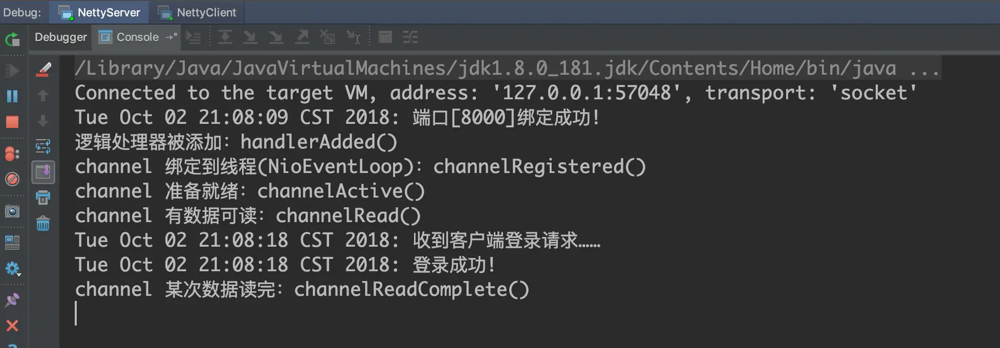

>在前面的小节中，对于 ChannelHandler，我们重点落在了读取数据相关的逻辑，这小节，我们来学习一下 ChannelHandler 的其他回调方法，这些回调方法的执行是有顺序的，
而这个执行顺序可以称为 ChannelHandler 的生命周期。

# ChannelHandler的生命周期详解

这小节，我们还是基于前面小节的代码，我们添加一个自定义 `ChannelHandler` 来测试一下各个回调方法的执行顺序。

对于服务端应用程序来说，我们这里讨论 `ChannelHandler` 更多的指的是 `ChannelInboundHandler`，在本小节，我们基于 `ChannelInboundHandlerAdapter`，
自定义了一个 `handler: LifeCyCleTestHandler`:

:::code-group
```java [LifeCyCleTestHandler.java]
public class LifeCyCleTestHandler extends ChannelInboundHandlerAdapter {
    @Override
    public void handlerAdded(ChannelHandlerContext ctx) throws Exception {
        System.out.println("逻辑处理器被添加：handlerAdded()");
        super.handlerAdded(ctx);
    }

    @Override
    public void channelRegistered(ChannelHandlerContext ctx) throws Exception {
        System.out.println("channel 绑定到线程(NioEventLoop)：channelRegistered()");
        super.channelRegistered(ctx);
    }

    @Override
    public void channelActive(ChannelHandlerContext ctx) throws Exception {
        System.out.println("channel 准备就绪：channelActive()");
        super.channelActive(ctx);
    }

    @Override
    public void channelRead(ChannelHandlerContext ctx, Object msg) throws Exception {
        System.out.println("channel 有数据可读：channelRead()");
        super.channelRead(ctx, msg);
    }

    @Override
    public void channelReadComplete(ChannelHandlerContext ctx) throws Exception {
        System.out.println("channel 某次数据读完：channelReadComplete()");
        super.channelReadComplete(ctx);
    }

    @Override
    public void channelInactive(ChannelHandlerContext ctx) throws Exception {
        System.out.println("channel 被关闭：channelInactive()");
        super.channelInactive(ctx);
    }

    @Override
    public void channelUnregistered(ChannelHandlerContext ctx) throws Exception {
        System.out.println("channel 取消线程(NioEventLoop) 的绑定: channelUnregistered()");
        super.channelUnregistered(ctx);
    }

    @Override
    public void handlerRemoved(ChannelHandlerContext ctx) throws Exception {
        System.out.println("逻辑处理器被移除：handlerRemoved()");
        super.handlerRemoved(ctx);
    }
}
```
:::

上面的代码可以看到，我们在每个方法被调用的时候都会打印一段文字，然后把这个事件继续往下传播。最后，我们把这个 `handler` 添加到我们在上小节构建的 `pipeline` 中:

```java
// 前面代码略
.childHandler(new ChannelInitializer<NioSocketChannel>() {
    protected void initChannel(NioSocketChannel ch) {
        // 添加到第一个
        ch.pipeline().addLast(new LifeCyCleTestHandler());
        ch.pipeline().addLast(new PacketDecoder());
        ch.pipeline().addLast(new LoginRequestHandler());
        ch.pipeline().addLast(new MessageRequestHandler());
        ch.pipeline().addLast(new PacketEncoder());
    }
});
```

接着，我们先运行 `NettyServer.java`，然后再运行 `NettyClient.java`，这个时候，`Server` 端控制台的输出为:



可以看到，`ChannelHandler` 回调方法的执行顺序为:

`handlerAdded() -> channelRegistered() -> channelActive() -> channelRead() -> channelReadComplete()`

下面，我们来逐个解释一下每个回调方法的含义:

1. `handlerAdded()` ：指的是当检测到新连接之后，调用 `ch.pipeline().addLast(new LifeCyCleTestHandler())`; 之后的回调，表示在当前的 `channel` 中，已经成功添加了一个 `handler` 处理器。

2. `channelRegistered()`：这个回调方法，表示当前的 `channel` 的所有的逻辑处理已经和某个 `NIO` 线程建立了绑定关系，类似我们在 `Netty` 是什么？这小节中 `BIO` 编程中，`accept` 到新的连接，
然后创建一个线程来处理这条连接的读写，只不过 `Netty` 里面是使用了线程池的方式，只需要从线程池里面去抓一个线程绑定在这个 `channel` 上即可，这里的 `NIO` 线程通常指的是 `NioEventLoop`,不理解没关系，后面我们还会讲到。

3. `channelActive()` ：当 `channel` 的所有的业务逻辑链准备完毕（也就是说 `channel` 的 `pipeline` 中已经添加完所有的 `handler`）以及绑定好一个 `NIO` 线程之后，这条连接算是真正激活了，接下来就会回调到此方法。

4. `channelRead()`：客户端向服务端发来数据，每次都会回调此方法，表示有数据可读。

5. `channelReadComplete()`：服务端每次读完一次完整的数据之后，回调该方法，表示数据读取完毕。

接下来，我们再把客户端关闭，这个时候对于服务端来说，其实就是 `channel` 被关闭:


`ChannelHandler` 回调方法的执行顺序为:

`channelInactive() -> channelUnregistered() -> handlerRemoved()`

到了这里，相信大家应该已经能够看到，这里的回调方法的执行顺序是新连接建立时候的逆操作，下面我们还是来解释一下每个方法的含义:

1. `channelInactive()`: 表面这条连接已经被关闭了，这条连接在 `TCP` 层面已经不再是 `ESTABLISH` 状态了

2. `channelUnregistered()`: 既然连接已经被关闭，那么与这条连接绑定的线程就不需要对这条连接负责了，这个回调就表明与这条连接对应的 `NIO` 线程移除掉对这条连接的处理

3. `handlerRemoved()`：最后，我们给这条连接上添加的所有的业务逻辑处理器都给移除掉。

最后，我们用一幅图来标识 `ChannelHandler` 的生命周期:


光是了解这些生命周期的回调方法其实是比较枯燥乏味的，我们接下来就来看一下这些回调方法的使用场景。

# ChannelHandler生命周期各回调方法用法举例

`Netty` 对于一条连接的在各个不同状态下回调方法的定义还是蛮细致的，这个好处就在于我们能够基于这个机制写出扩展性较好的应用程序。

## 1. ChannelInitializer 的实现原理

仔细翻看一下我们的服务端启动代码，我们在给新连接定义 `handler` 的时候，其实只是通过 `childHandler()` 方法给新连接设置了一个 `handler`，
这个 `handler` 就是 `ChannelInitializer`，而在 `ChannelInitializer` 的 `initChannel()` 方法里面，我们通过拿到 `channel` 对应的 `pipeline`，然后往里面塞 `handler`:

:::code-group
```java [NettyServer.java]
.childHandler(new ChannelInitializer<NioSocketChannel>() {
    protected void initChannel(NioSocketChannel ch) {
        ch.pipeline().addLast(new LifeCyCleTestHandler());
        ch.pipeline().addLast(new PacketDecoder());
        ch.pipeline().addLast(new LoginRequestHandler());
        ch.pipeline().addLast(new MessageRequestHandler());
        ch.pipeline().addLast(new PacketEncoder());
    }
});
```
:::

这里的 `ChannelInitializer` 其实就利用了 `Netty` 的 `handler` 生命周期中 `channelRegistered()` 与 `handlerAdded()` 两个特性，我们简单翻一翻 `ChannelInitializer` 这个类的源代码:

:::code-group
```java [ChannelInitializer.java]
protected abstract void initChannel(C ch) throws Exception;

public final void channelRegistered(ChannelHandlerContext ctx) throws Exception {
        // ...
        initChannel(ctx);
        // ...
}

public void handlerAdded(ChannelHandlerContext ctx) throws Exception {
        // ...
        if (ctx.channel().isRegistered()) {
            initChannel(ctx);
        }
        // ...
}

private boolean initChannel(ChannelHandlerContext ctx) throws Exception {
        if (initMap.putIfAbsent(ctx, Boolean.TRUE) == null) {
            initChannel((C) ctx.channel());
            // ...
            return true;
        }
        return false;
}
```
:::

这里，我把非重点代码略去，逻辑会更加清晰一些:

1. `ChannelInitializer` 定义了一个抽象的方法 `initChannel()`，这个抽象方法由我们自行实现，我们在服务端启动的流程里面的实现逻辑就是往 `pipeline` 里面塞我们的 `handler` 链

2. `handlerAdded()` 和 `channelRegistered()` 方法，都会尝试去调用 `initChannel()` 方法，`initChannel()` 使用 `putIfAbsent()` 来防止 `initChannel()` 被调用多次

3. 如果你 `debug` 了 `ChannelInitializer` 的上述两个方法，你会发现，在 `handlerAdded()` 方法被调用的时候，`channel` 其实已经和某个线程绑定上了，所以，就我们的应用程序来说，
这里的 `channelRegistered()` 其实是多余的，那为什么这里还要尝试调用一次呢？我猜测应该是担心我们自己写了个类继承自 `ChannelInitializer`，然后覆盖掉了 `handlerAdded()` 方法，
这样即使覆盖掉，在 `channelRegistered()` 方法里面还有机会再调一次 `initChannel()`，把我们自定义的 `handler` 都添加到 `pipeline` 中去。

## 2. handlerAdded() 与 handlerRemoved()

这两个方法通常可以用在一些资源的申请和释放

## 3. channelActive() 与 channelInActive()

1. 对我们的应用程序来说，这两个方法表明的含义是 `TCP` 连接的建立与释放，通常我们在这两个回调里面统计单机的连接数，`channelActive()` 被调用，连接数加一，`channelInActive()` 被调用，连接数减一

2. 另外，我们也可以在 `channelActive()` 方法中，实现对客户端连接 `ip` 黑白名单的过滤，具体这里就不展开了

## 4. channelRead()

我们在前面小节讲拆包粘包原理，服务端根据自定义协议来进行拆包，其实就是在这个方法里面，每次读到一定的数据，都会累加到一个容器里面，然后判断是否能够拆出来一个完整的数据包，
如果够的话就拆了之后，往下进行传递


## 5. channelReadComplete()

前面小节中，我们在每次向客户端写数据的时候，都通过 `writeAndFlush()` 的方法写并刷新到底层，其实这种方式不是特别高效，我们可以在之前调用 `writeAndFlush()` 的地方都调用 `write()` 方法，
然后在这个方面里面调用 `ctx.channel().flush()` 方法，相当于一个批量刷新的机制，当然，如果你对性能要求没那么高，`writeAndFlush()` 足矣。

关于 `ChannelHandler` 的生命周期相关的内容我们就讲到这，最后，我们对本小节内容作下总结

# 总结

1. 我们详细剖析了 `ChannelHandler`（`主要是ChannelInBoundHandler`）的各个回调方法，连接的建立和关闭，执行回调方法有个逆向的过程

2. 每一种回调方法都有他各自的用法，但是有的时候某些回调方法的使用边界有些模糊，恰当地使用回调方法来处理不同的逻辑，可以使你的应用程序更为优雅。