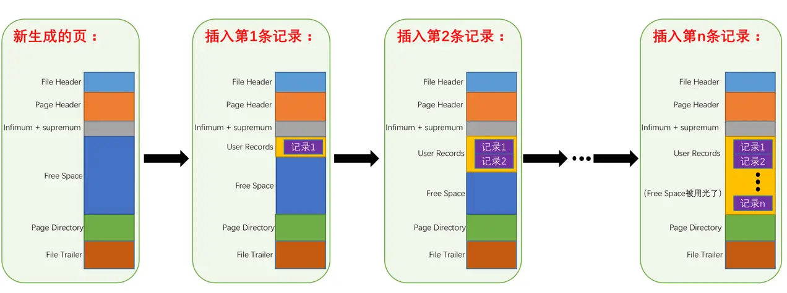
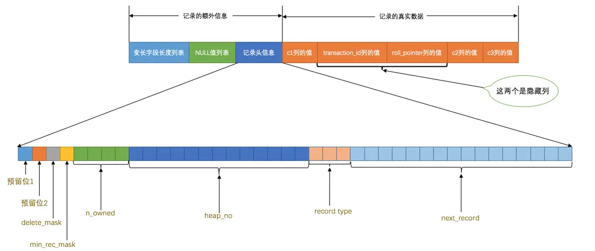
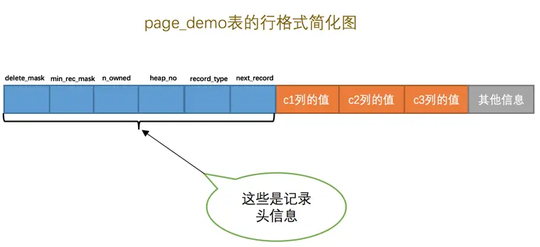
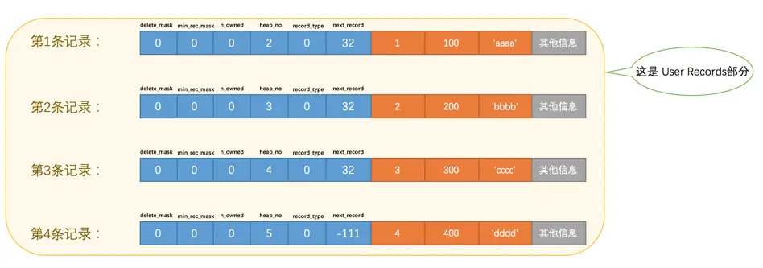
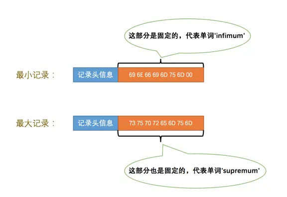
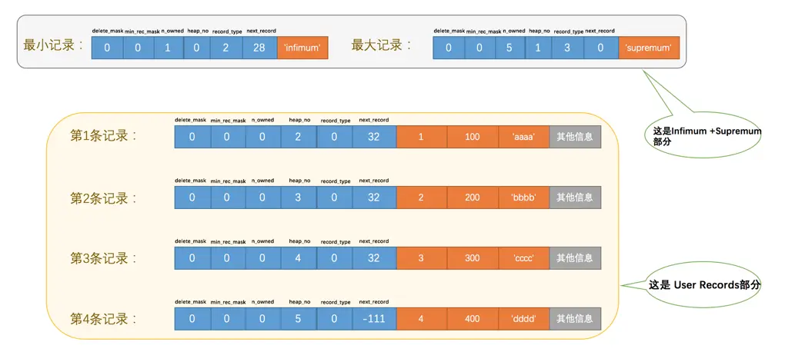
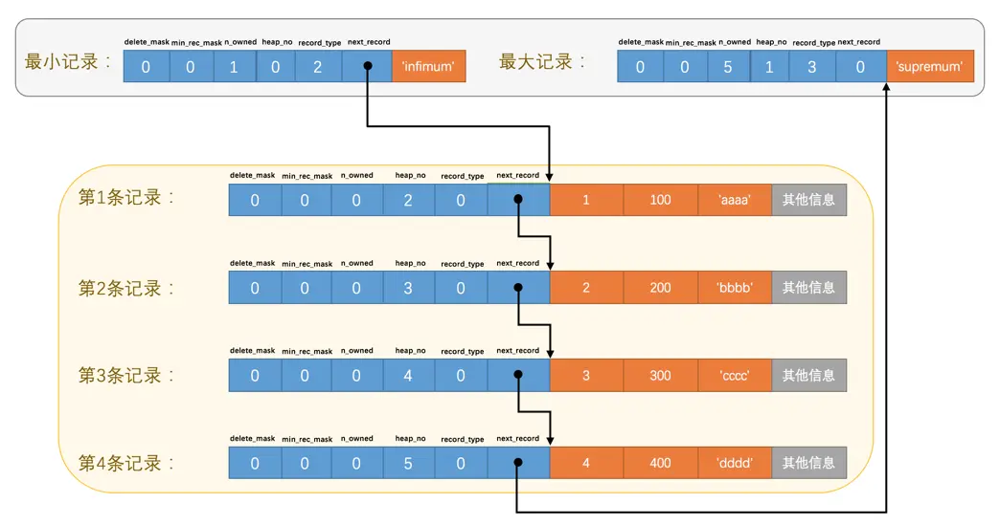
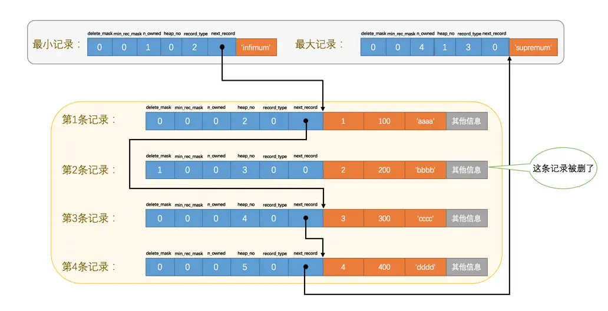
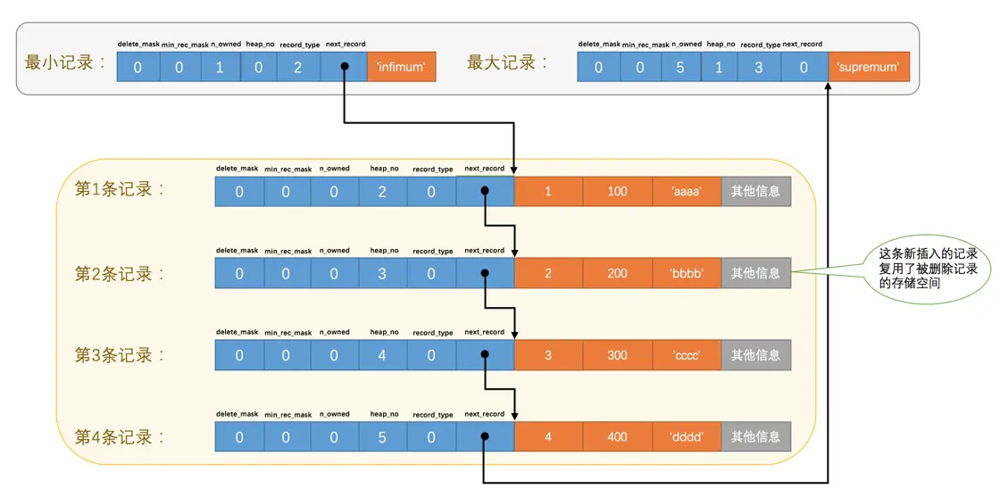

# 记录在页中的存储

在页的7个组成部分中，我们自己存储的记录会按照我们指定的行格式存储到`User Records`部分。但是在一开始生成页的时候，其实并没有`User Records`这个部分，每当我们插入一条记录，都会从`Free Space`部分，
也就是尚未使用的存储空间中申请一个记录大小的空间划分到`User Records`部分，当`Free Space`部分的空间全部被`User Records`部分替代掉之后，也就意味着这个页使用完了，如果还有新的记录插入的话，
就需要去申请新的页了，这个过程的图示如下：



为了更好的管理在`User Records`中的这些记录，`InnoDB`可费了一番力气呢，在哪费力气了呢？不就是把记录按照指定的行格式一条一条摆在`User Records`部分么？其实这话还得从记录行格式的记录头信息中说起。

## 记录头信息的秘密
为了故事的顺利发展，我们先创建一个表：

```sql
mysql> CREATE TABLE page_demo(
->     c1 INT,
->     c2 INT,
->     c3 VARCHAR(10000),
->     PRIMARY KEY (c1)
-> ) CHARSET=ascii ROW_FORMAT=Compact;
Query OK, 0 rows affected (0.03 sec)
```

这个新创建的`page_demo`表有3个列，其中`c1`和`c2`列是用来存储整数的，`c3`列是用来存储字符串的。需要注意的是，我们把 `c1` 列指定为主键，所以在具体的行格式中`InnoDB`就没必要为我们去创建那个所谓的 `row_id` 隐藏列了。
而且我们为这个表指定了`ascii`字符集以及`Compact`的行格式。所以这个表中记录的行格式示意图就是这样的：



从图中可以看到，我们特意把记录头信息的5个字节的数据给标出来了，说明它很重要，我们再次先把这些记录头信息中各个属性的大体意思浏览一下（我们目前使用`Compact`行格式进行演示）：

|     属性名称      |    大小（单位：bit）     |                       描述                        |
|:-------------:|:-----------------:|:-----------------------------------------------:|
|     预留位1      |         1         |                      没有使用                       |
|     预留位2      |         1         |                      没有使用                       |
|  delete_mask  |         1         |                   标记该记录是否被删除                    |
| min_rec_mask  |         1         |            B+树的每层非叶子节点中的最小记录都会添加该标记             |
|    n_owned    |         4         |                  表示当前记录拥有的记录数                   |
|    heap_no    |        13         |                 表示当前记录在记录堆的位置信息                 |
|  record_type  |         3         | 表示当前记录的类型，0表示普通记录，1表示B+树非叶节点记录，2表示最小记录，3表示最大记录  |
|  next_record  |        16         |                  表示下一条记录的相对位置                   |

由于我们现在主要在唠叨记录头信息的作用，所以为了大家理解上的方便，我们只在`page_demo`表的行格式演示图中画出有关的头信息属性以及`c1`、`c2`、`c3`列的信息（其他信息没画不代表它们不存在啊，
只是为了理解上的方便在图中省略了～），简化后的行格式示意图就是这样：



下边我们试着向`page_demo`表中插入几条记录：

```sql
mysql> INSERT INTO page_demo VALUES(1, 100, 'aaaa'), (2, 200, 'bbbb'), (3, 300, 'cccc'), (4, 400, 'dddd');
Query OK, 4 rows affected (0.00 sec)
Records: 4  Duplicates: 0  Warnings: 0
```
为了方便大家分析这些记录在页的`User Records`部分中是怎么表示的，我把记录中头信息和实际的列数据都用十进制表示出来了（其实是一堆二进制位），所以这些记录的示意图就是：



看这个图的时候需要注意一下，各条记录在`User Records`中存储的时候并没有空隙，这里只是为了大家观看方便才把每条记录单独画在一行中。我们对照着这个图来看看记录头信息中的各个属性是啥意思：

* `delete_mask`

这个属性标记着当前记录是否被删除，占用1个二进制位，值为0的时候代表记录并没有被删除，为1的时候代表记录被删除掉了。

啥？被删除的记录还在页中么？是的，摆在台面上的和背地里做的可能大相径庭，你以为它删除了，可它还在真实的磁盘上。这些被删除的记录之所以不立即从磁盘上移除，
是因为移除它们之后把其他的记录在磁盘上重新排列需要性能消耗，所以只是打一个删除标记而已，所有被删除掉的记录都会组成一个所谓的垃圾链表，在这个链表中的记录占用的空间称之为所谓的可重用空间，
之后如果有新记录插入到表中的话，可能把这些被删除的记录占用的存储空间覆盖掉。

:::tip 小贴士
将这个delete_mask位设置为1和将被删除的记录加入到垃圾链表中其实是两个阶段
:::

* `min_rec_mask`

B+树的每层非叶子节点中的最小记录都会添加该标记，什么是个B+树？什么是个非叶子节点？好吧，等会再聊这个问题。反正我们自己插入的四条记录的`min_rec_mask`值都是0，意味着它们都不是B+树的非叶子节点中的最小记录。

* `n_owned`

这个暂时保密，稍后它是主角～

* `heap_no`

这个属性表示当前记录在本页中的位置，从图中可以看出来，我们插入的4条记录在本页中的位置分别是：`2、3、4、5`。是不是少了点啥？是的，怎么不见`heap_no`值为0和1的记录呢？

这其实是设计`InnoDB`的大叔们玩的一个小把戏，他们自动给每个页里边儿加了两个记录，由于这两个记录并不是我们自己插入的，所以有时候也称为伪记录或者虚拟记录。这两个伪记录一个代表最小记录，
一个代表最大记录，等一下哈~，记录可以比大小么？

是的，记录也可以比大小，对于一条完整的记录来说，比较记录的大小就是比较主键的大小。比方说我们插入的4行记录的主键值分别是：`1、2、3、4`，这也就意味着这4条记录的大小从小到大依次递增。

:::tip 小贴士
请注意我强调了对于一条完整的记录来说，比较记录的大小就相当于比的是主键的大小。
:::

但是不管我们向页中插入了多少自己的记录，设计`InnoDB`的大叔们都规定他们定义的两条伪记录分别为最小记录与最大记录。这两条记录的构造十分简单，都是由5字节大小的`记录头信息`和8字节大小的一个固定的部分组成的，如图所示:



由于这两条记录不是我们自己定义的记录，所以它们并不存放在`页`的`User Records`部分，他们被单独放在一个称为`Infimum + Supremum`的部分，如图所示：



从图中我们可以看出来，最小记录和最大记录的`heap_no`值分别是`0`和`1`，也就是说它们的位置最靠前。

* `record_type`

这个属性表示当前记录的类型，一共有4种类型的记录，0表示普通记录，1表示B+树非叶节点记录，2表示最小记录，3表示最大记录。从图中我们也可以看出来，我们自己插入的记录就是普通记录，
它们的`record_type`值都是0，而最小记录和最大记录的`record_type`值分别为2和3。

至于`record_type`为1的情况，我们之后在说索引的时候会重点强调的。

* `next_record`

这玩意儿非常重要，它表示从当前记录的真实数据到下一条记录的真实数据的地址偏移量。比方说第一条记录的`next_record`值为32，意味着从第一条记录的真实数据的地址处向后找32个字节便是下一条记录的真实数据。
如果你熟悉数据结构的话，就立即明白了，这其实是个链表，可以通过一条记录找到它的下一条记录。 但是需要注意注意再注意的一点是，下一条记录指得并不是按照我们插入顺序的下一条记录，而是按照主键值由小到大的顺序的下一条记录。
而且规定 `Infimum`记录（也就是最小记录） 的下一条记录就是本页中主键值最小的用户记录，而本页中主键值最大的用户记录的下一条记录就是 `Supremum`记录（也就是最大记录） ，为了更形象的表示一下这个`next_record`起到的作用，我们用箭头来替代一下`next_record`中的地址偏移量：



从图中可以看出来，我们的记录按照主键从小到大的顺序形成了一个单链表。最大记录的`next_record`的值为0，这也就是说最大记录是没有下一条记录了，它是这个单链表中的最后一个节点。如果从中删除掉一条记录，这个链表也是会跟着变化的，比如我们把第2条记录删掉：

```sql
mysql> DELETE FROM page_demo WHERE c1 = 2;
Query OK, 1 row affected (0.02 sec)
```

删掉第2条记录后的示意图就是：



从图中可以看出来，删除第2条记录前后主要发生了这些变化：

&emsp;  1、第2条记录并没有从存储空间中移除，而是把该条记录的`delete_mask`值设置为1。

&emsp;  2、第2条记录的`next_record`值变为了0，意味着该记录没有下一条记录了。

&emsp;  3、第1条记录的`next_record`指向了第3条记录。

&emsp;  4、还有一点你可能忽略了，就是最大记录的`n_owned`值从5变成了4，关于这一点的变化我们稍后会详细说明的。

&emsp;  5、所以，不论我们怎么对页中的记录做增删改操作，`InnoDB`始终会维护一条记录的单链表，链表中的各个节点是按照主键值由小到大的顺序连接起来的。

:::tip 小贴士
你会不会觉得next_record这个指针有点儿怪，为啥要指向记录头信息和真实数据之间的位置呢？为啥不干脆指向整条记录的开头位置，也就是记录的额外信息开头的位置呢？
:::

因为这个位置刚刚好，向左读取就是记录头信息，向右读取就是真实数据。我们前边还说过`变长字段长度列表`、`NULL值列表`中的信息都是逆序存放，这样可以使记录中位置靠前的字段和它们对应的字段长度信息在内存中的距离更近
，可能会提高高速缓存的命中率。当然如果你看不懂这句话的话就不要勉强了，果断跳过～

再来看一个有意思的事情，因为主键值为2的记录被我们删掉了，但是存储空间却没有回收，如果我们再次把这条记录插入到表中，会发生什么事呢？

```sql
mysql> INSERT INTO page_demo VALUES(2, 200, 'bbbb');
Query OK, 1 row affected (0.00 sec)
```
我们看一下记录的存储情况：



从图中可以看到，`InnoDB`并没有因为新记录的插入而为它申请新的存储空间，而是直接复用了原来被删除记录的存储空间。

:::tip 小贴士
当数据页中存在多条被删除掉的记录时，这些记录的next_record属性将会把这些被删除掉的记录组成一个垃圾链表，以备之后重用这部分存储空间。
:::


