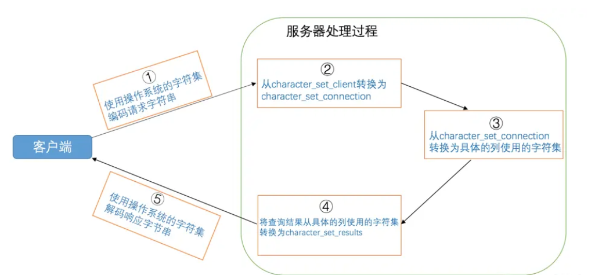

# 字符集和比较规则的应用

## 各级别的字符集和比较规则

MySQL有4个级别的字符集和比较规则，分别是：

* 服务器级别
* 数据库级别
* 表级别
* 列级别

我们接下来仔细看一下怎么设置和查看这几个级别的字符集和比较规则。

### 服务器级别

MySQL提供了两个系统变量来表示服务器级别的字符集和比较规则：

| 系统变量 | 描述  |
|:-----|:----|
|character_set_server|服务器级别的字符集|
|collation_server|服务器级别的比较规则|

我们看一下这两个系统变量的值：
```sql
mysql> SHOW VARIABLES LIKE 'character_set_server';
+----------------------+-------+
| Variable_name        | Value |
+----------------------+-------+
| character_set_server | utf8  |
+----------------------+-------+
1 row in set (0.00 sec)

mysql> SHOW VARIABLES LIKE 'collation_server';
+------------------+-----------------+
| Variable_name    | Value           |
+------------------+-----------------+
| collation_server | utf8_general_ci |
+------------------+-----------------+
1 row in set (0.00 sec)
```

可以看到在我的计算机中服务器级别默认的字符集是`utf8`，默认的比较规则是`utf8_general_ci`。

我们可以在启动服务器程序时通过启动选项或者在服务器程序运行过程中使用`SET`语句修改这两个变量的值。比如我们可以在配置文件中这样写：

```sql
[server]
character_set_server=gbk
collation_server=gbk_chinese_ci
```

当服务器启动的时候读取这个配置文件后这两个系统变量的值便修改了。

### 数据库级别

我们在创建和修改数据库的时候可以指定该数据库的字符集和比较规则，具体语法如下：
```sql
CREATE DATABASE 数据库名
    [[DEFAULT] CHARACTER SET 字符集名称]
    [[DEFAULT] COLLATE 比较规则名称];

ALTER DATABASE 数据库名
    [[DEFAULT] CHARACTER SET 字符集名称]
    [[DEFAULT] COLLATE 比较规则名称];
```
其中的DEFAULT可以省略，并不影响语句的语义。比方说我们新创建一个名叫`charset_demo_db`的数据库，在创建的时候指定它使用的字符集为`gb2312`，比较规则为`gb2312_chinese_ci`：

```sql
mysql> CREATE DATABASE charset_demo_db
-> CHARACTER SET gb2312
-> COLLATE gb2312_chinese_ci;
Query OK, 1 row affected (0.01 sec)
```

如果想查看当前数据库使用的字符集和比较规则，可以查看下面两个系统变量的值（前提是使用`USE`语句选择当前默认数据库，如果没有默认数据库，则变量与相应的服务器级系统变量具有相同的值）：

| 系统变量 | 描述  |
|:-----|:----|
|character_set_database|当前数据库的字符集|
|collation_database|当前数据库的比较规则|

我们来查看一下刚刚创建的`charset_demo_db`数据库的字符集和比较规则：
```sql

mysql> USE charset_demo_db;
Database changed

mysql> SHOW VARIABLES LIKE 'character_set_database';
+------------------------+--------+
| Variable_name          | Value  |
+------------------------+--------+
| character_set_database | gb2312 |
+------------------------+--------+
1 row in set (0.00 sec)

mysql> SHOW VARIABLES LIKE 'collation_database';
+--------------------+-------------------+
| Variable_name      | Value             |
+--------------------+-------------------+
| collation_database | gb2312_chinese_ci |
+--------------------+-------------------+
1 row in set (0.00 sec)

mysql>
```

可以看到这个`charset_demo_db`数据库的字符集和比较规则就是我们在创建语句中指定的。需要注意的一点是： `character_set_database` 和 `collation_database` 这两个系统变量是只读的，
我们不能通过修改这两个变量的值而改变当前数据库的字符集和比较规则。

数据库的创建语句中也可以不指定字符集和比较规则，比如这样：

```sql
CREATE DATABASE 数据库名;
```

这样的话将使用服务器级别的字符集和比较规则作为数据库的字符集和比较规则。

### 表级别
 
我们也可以在创建和修改表的时候指定表的字符集和比较规则，语法如下：

```sql
CREATE TABLE 表名 (列的信息)
    [[DEFAULT] CHARACTER SET 字符集名称]
    [COLLATE 比较规则名称]]

ALTER TABLE 表名
    [[DEFAULT] CHARACTER SET 字符集名称]
    [COLLATE 比较规则名称]
```

比方说我们在刚刚创建的`charset_demo_db`数据库中创建一个名为`t`的表，并指定这个表的字符集和比较规则：

```sql
mysql> CREATE TABLE t(
->     col VARCHAR(10)
-> ) CHARACTER SET utf8 COLLATE utf8_general_ci;
Query OK, 0 rows affected (0.03 sec)
```

如果创建和修改表的语句中没有指明字符集和比较规则，将使用该表所在数据库的字符集和比较规则作为该表的字符集和比较规则。假设我们的创建`表t`的语句是这么写的：

```sql
CREATE TABLE t(
col VARCHAR(10)
);
```
因为`表t`的建表语句中并没有明确指定字符集和比较规则，则`表t`的字符集和比较规则将继承所在数据库`charset_demo_db`的字符集和比较规则，也就是`gb2312`和`gb2312_chinese_ci`。

### 列级别

需要注意的是，对于存储字符串的列，同一个表中的不同的列也可以有不同的字符集和比较规则。我们在创建和修改列定义的时候可以指定该列的字符集和比较规则，语法如下：

```sql
CREATE TABLE 表名(
列名 字符串类型 [CHARACTER SET 字符集名称] [COLLATE 比较规则名称],
其他列...
);

ALTER TABLE 表名 MODIFY 列名 字符串类型 [CHARACTER SET 字符集名称] [COLLATE 比较规则名称];
```

比如我们修改一下`表t`中`列col`的字符集和比较规则可以这么写：

```sql
mysql> ALTER TABLE t MODIFY col VARCHAR(10) CHARACTER SET gbk COLLATE gbk_chinese_ci;
Query OK, 0 rows affected (0.04 sec)
Records: 0  Duplicates: 0  Warnings: 0

mysql>
```
对于某个列来说，如果在创建和修改的语句中没有指明字符集和比较规则，将使用该列所在表的字符集和比较规则作为该列的字符集和比较规则。
比方说`表t`的字符集是`utf8`，比较规则是`utf8_general_ci`，修改`列col`的语句是这么写的：

```sql
ALTER TABLE t MODIFY col VARCHAR(10);
```

那`列col`的字符集和编码将使用`表t`的字符集和比较规则，也就是`utf8`和`utf8_general_ci`。

:::tip 小贴士：
在转换列的字符集时需要注意，如果转换前列中存储的数据不能用转换后的字符集进行表示会发生错误。比方说原先列使用的字符集是utf8，列中存储了一些汉字，现在把列的字符集转换为ascii的话就会出错，因为ascii字符集并不能表示汉字字符。
:::

### 仅修改字符集或仅修改比较规则

由于字符集和比较规则是互相有联系的，如果我们只修改了字符集，比较规则也会跟着变化，如果只修改了比较规则，字符集也会跟着变化，具体规则如下：

* 只修改字符集，则比较规则将变为修改后的字符集默认的比较规则。
* 只修改比较规则，则字符集将变为修改后的比较规则对应的字符集。

不论哪个级别的字符集和比较规则，这两条规则都适用，我们以服务器级别的字符集和比较规则为例来看一下详细过程：

* 只修改字符集，则比较规则将变为修改后的字符集默认的比较规则。

```sql
mysql> SET character_set_server = gb2312;
Query OK, 0 rows affected (0.00 sec)

mysql> SHOW VARIABLES LIKE 'character_set_server';
+----------------------+--------+
| Variable_name        | Value  |
+----------------------+--------+
| character_set_server | gb2312 |
+----------------------+--------+
1 row in set (0.00 sec)

mysql>  SHOW VARIABLES LIKE 'collation_server';
+------------------+-------------------+
| Variable_name    | Value             |
+------------------+-------------------+
| collation_server | gb2312_chinese_ci |
+------------------+-------------------+
1 row in set (0.00 sec)
```
我们只修改了`character_set_server`的值为`gb2312`，`collation_server`的值自动变为了`gb2312_chinese_ci`。

* 只修改比较规则，则字符集将变为修改后的比较规则对应的字符集。

```sql
mysql> SET collation_server = utf8_general_ci;
Query OK, 0 rows affected (0.00 sec)

mysql> SHOW VARIABLES LIKE 'character_set_server';
+----------------------+-------+
| Variable_name        | Value |
+----------------------+-------+
| character_set_server | utf8  |
+----------------------+-------+
1 row in set (0.00 sec)

mysql> SHOW VARIABLES LIKE 'collation_server';
+------------------+-----------------+
| Variable_name    | Value           |
+------------------+-----------------+
| collation_server | utf8_general_ci |
+------------------+-----------------+
1 row in set (0.00 sec)

mysql>
```
我们只修改了`collation_server`的值为`utf8_general_ci`，`character_set_server`的值自动变为了`utf8`。

### 各级别字符集和比较规则小结

我们介绍的这4个级别字符集和比较规则的联系如下：

* 如果创建或修改列时没有显式的指定字符集和比较规则，则该列默认用表的字符集和比较规则
* 如果创建表时没有显式的指定字符集和比较规则，则该表默认用数据库的字符集和比较规则
* 如果创建数据库时没有显式的指定字符集和比较规则，则该数据库默认用服务器的字符集和比较规则
知道了这些规则之后，对于给定的表，我们应该知道它的各个列的字符集和比较规则是什么，从而根据这个列的类型来确定存储数据时每个列的实际数据占用的存储空间大小了。比方说我们向`表t`中插入一条记录：

```sql
mysql> INSERT INTO t(col) VALUES('我我');
Query OK, 1 row affected (0.00 sec)

mysql> SELECT * FROM t;
+--------+
| s      |
+--------+
| 我我   |
+--------+
1 row in set (0.00 sec)
```
首先`列col`使用的字符集是`gbk`，一个字符 `'我'` 在`gbk`中的编码为`0xCED2`，占用两个字节，两个字符的实际数据就占用4个字节。如果把该列的字符集修改为`utf8`的话，这两个字符就实际占用6个字节

## 客户端和服务器通信中的字符集

### 编码和解码使用的字符集不一致的后果

说到底，字符串在计算机上的体现就是一个字节串，如果你使用不同字符集去解码这个字节串，最后得到的结果可能让你挠头。

我们知道字符 `'我'` 在`utf8`字符集编码下的字节串长这样：`0xE68891`，如果一个程序把这个字节串发送到另一个程序里，另一个程序用不同的字符集去解码这个字节串，
假设使用的是`gbk`字符集来解释这串字节，解码过程就是这样的：

1、首先看第一个字节`0xE6`，它的值大于`0x7F`（十进制：127），说明是两字节编码，继续读一字节后是`0xE688`，然后从`gbk`编码表中查找字节为`0xE688`对应的字符，发现是字符 `'鎴'`

2、继续读一个字节`0x91`，它的值也大于`0x7F`，再往后读一个字节发现木有了，所以这是半个字符。

3、所以`0xE68891`被`gbk`字符集解释成一个字符 `'鎴'` 和半个字符。

假设用`iso-8859-1`，也就是`latin1`字符集去解释这串字节，解码过程如下：

1、先读第一个字节`0xE6`，它对应的`latin1`字符为`æ`。

2、再读第二个字节`0x88`，它对应的`latin1`字符为`ˆ`。

3、再读第三个字节`0x91`，它对应的`latin1`字符为 `‘`。

4、所以整串字节`0xE68891`被`latin1`字符集解释后的字符串就是 `'我'`

可见，如果对于同一个字符串编码和解码使用的字符集不一样，会产生意想不到的结果，作为人类的我们看上去就像是产生了乱码一样。

### 字符集转换的概念

如果接收`0xE68891`这个字节串的程序按照`utf8`字符集进行解码，然后又把它按照`gbk`字符集进行编码，最后编码后的字节串就是`0xCED2`，我们把这个过程称为字符集的转换，
也就是字符串 `'我'` 从`utf8`字符集转换为`gbk`字符集。

### MySQL中字符集的转换

我们知道从客户端发往服务器的请求本质上就是一个字符串，服务器向客户端返回的结果本质上也是一个字符串，而字符串其实是使用某种字符集编码的二进制数据。
这个字符串可不是使用一种字符集的编码方式一条道走到黑的，从发送请求到返回结果这个过程中伴随着多次字符集的转换，在这个过程中会用到3个系统变量，我们先把它们写出来看一下：

| 系统变量 | 描述 |
|:-----|:----|
|character_set_client|客户端发送请求时使用的字符集|
|character_set_connection|服务器处理请求时会把请求字符串从character_set_client转为character_set_connection|
|character_set_results|服务器向客户端返回数据时使用的字符集|

这几个系统变量在我的计算机上的默认值如下（不同操作系统的默认值可能不同）：

```sql
mysql> SHOW VARIABLES LIKE 'character_set_client';
+----------------------+-------+
| Variable_name        | Value |
+----------------------+-------+
| character_set_client | utf8  |
+----------------------+-------+
1 row in set (0.00 sec)

mysql> SHOW VARIABLES LIKE 'character_set_connection';
+--------------------------+-------+
| Variable_name            | Value |
+--------------------------+-------+
| character_set_connection | utf8  |
+--------------------------+-------+
1 row in set (0.01 sec)

mysql> SHOW VARIABLES LIKE 'character_set_results';
+-----------------------+-------+
| Variable_name         | Value |
+-----------------------+-------+
| character_set_results | utf8  |
+-----------------------+-------+
1 row in set (0.00 sec)
```

大家可以看到这几个系统变量的值都是`utf8`，为了体现出字符集在请求处理过程中的变化，我们这里特意修改一个系统变量的值：

```sql
mysql> set character_set_connection = gbk;
Query OK, 0 rows affected (0.00 sec)
```

所以现在系统变量`character_set_client`和`character_set_results`的值还是`utf8`，而`character_set_connection`的值为`gbk`。
现在假设我们客户端发送的请求是下边这个字符串：

```sql
SELECT * FROM t WHERE s = '我';
```

为了方便大家理解这个过程，我们只分析字符 `'我'` 在这个过程中字符集的转换。

现在看一下在请求从发送到结果返回过程中字符集的变化：

1、客户端发送请求所使用的字符集

   一般情况下客户端所使用的字符集和当前操作系统一致，不同操作系统使用的字符集可能不一样，如下：

   * 类`Unix`系统使用的是`utf8`
   * `Windows`使用的是`gbk`

   例如我在使用的`macOS`操作系统时，客户端使用的就是`utf8`字符集。所以字符 `'我'` 在发送给服务器的请求中的字节形式就是：`0xE68891`

:::tip 小贴士：
如果你使用的是可视化工具，比如navicat之类的，这些工具可能会使用自定义的字符集来编码发送到服务器的字符串，而不采用操作系统默认的字符集。
:::

2、服务器接收到客户端发送来的请求其实是一串二进制的字节，它会认为这串字节采用的字符集是`character_set_client`，然后把这串字节转换为`character_set_connection`字符集编码的字符。

   由于我的计算机上`character_set_client`的值是`utf8`，首先会按照`utf8`字符集对字节串`0xE68891`进行解码，得到的字符串就是 `'我'`，然后按照`character_set_connection`代表的字符集，也就是`gbk`进行编码，得到的结果就是字节串`0xCED2`。

3、因为`表t`的`列col`采用的是`gbk`字符集，与`character_set_connection`一致，所以直接到列中找字节值为`0xCED2`的记录，最后找到了一条记录。

:::tip 小贴士：
如果某个列使用的字符集和character_set_connection代表的字符集不一致的话，还需要进行一次字符集转换。
:::

4、上一步骤找到的记录中的`col列`其实是一个字节串`0xCED2`，`col列`是采用`gbk`进行编码的，所以首先会将这个字节串使用`gbk`进行解码，得到字符串 `'我'`，
然后再把这个字符串使用`character_set_results`代表的字符集，也就是`utf8`进行编码，得到了新的字节串：`0xE68891`，然后发送给客户端。

5、由于客户端是用的字符集是`utf8`，所以可以顺利的将`0xE68891`解释成字符`我`，从而显示到我们的显示器上，所以我们人类也读懂了返回的结果。

如果你读上边的文字有点晕，可以参照这个图来仔细分析一下这几个步骤：



从这个分析中我们可以得出这么几点需要注意的地方：

* 服务器认为客户端发送过来的请求是用`character_set_client`编码的。

   假设你的客户端采用的字符集和 `character_set_client` 不一样的话，这就会出现意想不到的情况。比如我的客户端使用的是`utf8`字符集，如果把系统变量`character_set_client`的值设置为`ascii`的话，服务器可能无法理解我们发送的请求，更别谈处理这个请求了。

* 服务器将把得到的结果集使用`character_set_results`编码后发送给客户端。

   假设你的客户端采用的字符集和 `character_set_results` 不一样的话，这就可能会出现客户端无法解码结果集的情况，结果就是在你的屏幕上出现乱码。比如我的客户端使用的是`utf8`字符集，如果把系统变量`character_set_results`的值设置为`ascii`的话，可能会产生乱码。

* `character_set_connection`只是服务器在将请求的字节串从`character_set_client`转换为`character_set_connection`时使用，它是什么其实没多重要，但是一定要注意，该字符集包含的字符范围一定涵盖请求中的字符，要不然会导致有的字符无法使用`character_set_connection`代表的字符集进行编码。比如你把`character_set_client`设置为`utf8`，把`character_set_connection`设置成`ascii`，那么此时你如果从客户端发送一个汉字到服务器，那么服务器无法使用ascii字符集来编码这个汉字，就会向用户发出一个警告。

知道了在MySQL中从发送请求到返回结果过程里发生的各种字符集转换，但是为啥要转来转去的呢？不晕么？

答：是的，很头晕，所以我们通常都把 `character_set_client` 、`character_set_connection`、`character_set_results` 这三个系统变量设置成和客户端使用的字符集一致的情况，这样减少了很多无谓的字符集转换。为了方便我们设置，MySQL提供了一条非常简便的语句：

```sql
SET NAMES 字符集名;
```

这一条语句产生的效果和我们执行这3条的效果是一样的：

```sql
SET character_set_client = 字符集名;
SET character_set_connection = 字符集名;
SET character_set_results = 字符集名;
```
比方说我的客户端使用的是`utf8`字符集，所以需要把这几个系统变量的值都设置为`utf8`：

```sql
mysql> SET NAMES utf8;
Query OK, 0 rows affected (0.00 sec)

mysql> SHOW VARIABLES LIKE 'character_set_client';
+----------------------+-------+
| Variable_name        | Value |
+----------------------+-------+
| character_set_client | utf8  |
+----------------------+-------+
1 row in set (0.00 sec)

mysql>  SHOW VARIABLES LIKE 'character_set_connection';
+--------------------------+-------+
| Variable_name            | Value |
+--------------------------+-------+
| character_set_connection | utf8  |
+--------------------------+-------+
1 row in set (0.00 sec)

mysql> SHOW VARIABLES LIKE 'character_set_results';
+-----------------------+-------+
| Variable_name         | Value |
+-----------------------+-------+
| character_set_results | utf8  |
+-----------------------+-------+
1 row in set (0.00 sec)

mysql>
```
:::tip 小贴士：
如果你使用的是Windows系统，那应该设置成gbk。
:::

另外，如果你想在启动客户端的时候就把`character_set_client`、`character_set_connection`、`character_set_results`这三个系统变量的值设置成一样的，那我们可以在启动客户端的时候指定一个叫`default-character-set`的启动选项，比如在配置文件里可以这么写：

```sql
[client]
default-character-set=utf8
```

它起到的效果和执行一遍`SET NAMES utf8`是一样一样的，都会将那三个系统变量的值设置成`utf8`。

## 比较规则的应用

结束了字符集的漫游，我们把视角再次聚焦到比较规则，比较规则的作用通常体现比较字符串大小的表达式以及对某个字符串列进行排序中，所以有时候也称为排序规则。比方说`表t`的`列col`使用的字符集是`gbk`，使用的比较规则是`gbk_chinese_ci`，我们向里边插入几条记录：

```sql
mysql> INSERT INTO t(col) VALUES('a'), ('b'), ('A'), ('B');
Query OK, 4 rows affected (0.00 sec)
Records: 4  Duplicates: 0  Warnings: 0

mysql>
```
我们查询的时候按照`t列`排序一下：

```sql
mysql> SELECT * FROM t ORDER BY col;
+------+
| col  |
+------+
| a    |
| A    |
| b    |
| B    |
| 我   |
+------+
5 rows in set (0.00 sec)
```
可以看到在默认的比较规则`gbk_chinese_ci`中是不区分大小写的，我们现在把`列col`的比较规则修改为`gbk_bin`：

```sql
mysql> ALTER TABLE t MODIFY col VARCHAR(10) COLLATE gbk_bin;
Query OK, 5 rows affected (0.02 sec)
Records: 5  Duplicates: 0  Warnings: 0
```
由于`gbk_bin`是直接比较字符的编码，所以是区分大小写的，我们再看一下排序后的查询结果：

```sql
mysql> SELECT * FROM t ORDER BY s;
+------+
| s    |
+------+
| A    |
| B    |
| a    |
| b    |
| 我   |
+------+
5 rows in set (0.00 sec)

mysql>
```
所以如果以后大家在对字符串做比较或者对某个字符串列做排序操作时没有得到想象中的结果，需要思考一下是不是比较规则的问题～

:::tip 小贴士：
列col中各个字符在使用gbk字符集编码后对应的数字如下： 'A' -> 65 （十进制） 'B' -> 66 （十进制） 'a' -> 97 （十进制） 'b' -> 98 （十进制） '我' -> 25105 （十进制）
:::
