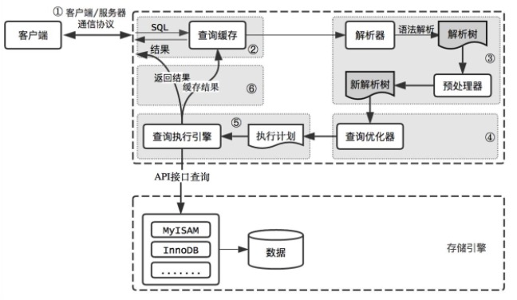

大体来说，MySQL可以分为`Server层`和`存储引擎`两部分:

* **Server层**: 包括`连接器`、`分析器`、`查询缓存`、`优化器`、`执行器`。
* **存储引擎**： 负责数据的存储和提取。其架构模式是插件式的，支持InnoDB、MyISAM、Memory等多种存储模式。现如今最常用的存储引擎是InnoDB，它从MySQL5.5.5开始成为默认存储引擎。也就是说当我们不指定存储引擎时默认使用的就是InnoDB，
我们也可以在`create table`时通过`engine=memory`来指定存储引擎。

## 连接器

首先我们需要连接上数据库，这时候接待我们的就是连接器，连接器主要负责的工作就是跟客户端建立连接、获取权限、维持和管理连接。连接命令如下:

```shell
mysql -h$ip -P$port -u$user -p
$ip: 服务器IP
$port： MySQL端口号
$user： 用户名
```

* 如果用户名或密码不对，则会收到一个`Access denied for user`错误，然后客户端程序结束执行。
* 如果用户名密码认证通过，连接器则会去权限表中查询该用户所拥有的权限，这个链接里的权限逻辑判断，全都依赖于此时读到的权限。

这就意味着，当一个用户成功建立连接后，即使使用管理员账户对其权限做了修改，也不会立即生效，只有重新建立链接后才会使用新的权限设置。

## 查询缓存

链接建立成功后，会先查询缓存。

MySQL拿到一个SQL语句之后会先到缓存看看是否在此之前执行过这条语句，之前执行的语句会以`key-value`的形式直接缓存在内存中。`key`是`查询语句`，`value`是`查询结果`。如果你的查询能在缓存中找到响应的`key`，则直接返回其对应的`value`给客户端。
如果语句不再查询缓存中，就会继续执行后面的阶段。执行完成后，执行结果会被存入查询缓存中。你可以看到，如果命中缓存，MySQL不需要执行后面的复杂操作，就可以执行返回结果，这个效率会很高。

## 分析器

如果没有命中缓存，则真正开始执行语句了。

分析器首先进行`词法分析`。我们输入的SQL是由多个字符串组成的，MySQL需要识别出来里面的字符串分别是什么。
词法分析结束之后，需要对SQL进行语法分析。根据词法分析的结果，语法分析器会根据语法规则来判断我们输入的这条SQL是否满足MySQL的语法规则，如果我们的语法不对是话，我们会收到MySQL的错误提示`You have an error in your SQL syntax`。

## 优化器

经过了分析器，MySQL知道我们要做什么了，在它开始执行之前，还要先经过优化器的处理。

优化器是在表里面有多个索引的时候，决定使用那个索引，或者在一个语句有多表关联的时候，决定各个表的连接顺序。

```shell
select * from t1 join t2 using(ID)  where t1.c=10 and t2.d=20;
```

>using()等价于on -> 当t1表于t2表关联的字段相同时 using(field) 和 t1.field = t2.field等价

* 既可以先从表t1里面取出c=10的ID值，再根据ID值去关联到表t2，在判断t2里面的d值是否等于20。
* 也可以先从表t2里面取出d=20的记录的ID值关联到t1，再判断t1里面的c值是否等于10。

这两种执行方法的逻辑和结果都是一样的，但是执行效率会有所不同，优化器的作用就是决定选择哪种方案。

## 执行器

开始执行的时候，首先要确认我们是否有操作这个表的权限，如果没有权限则会返回没有权限的错误:

```shell
mysql> select * from T where ID=10;

ERROR 1142 (42000): SELECT command denied to user 'b'@'localhost' for table 'T'
```

如果有权限，就打开表极限执行，打开表的时候执行器会根据表的引擎定义，去使用这个引擎提供的接口。

比如在这个例子中的表T中的ID字段时没有索引的，那么执行器的流程是这样的：

* 条用InnoDB引擎接口去这个表的第一行，判断ID是否为10，如果不是则跳过，如果时则将这行存在结果集中。
* 调用引擎接口取下一行，重复相同的逻辑判断，直到取到这个表的最后一行。
* 执行器将上述便利过程的所有满足条件的行组成的记录集作为结果集返回给客户端。