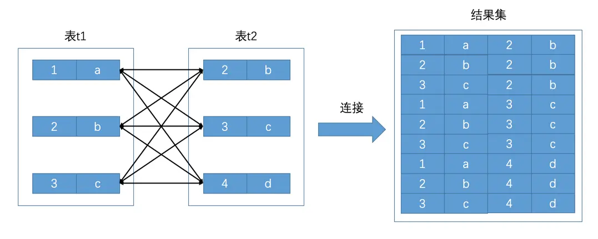
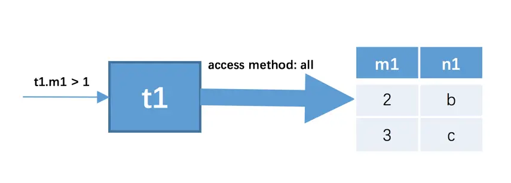
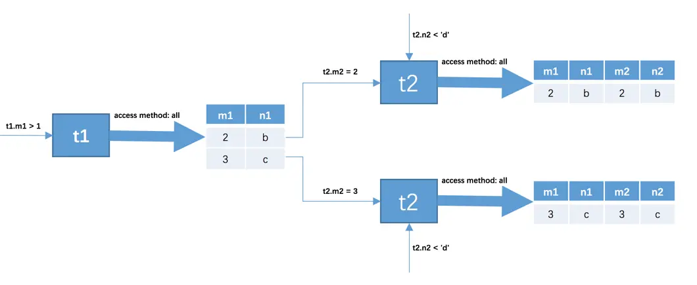

搞数据库一个避不开的概念就是`Join`，翻译成中文就是`连接`。相信很多小伙伴在初学连接的时候有些一脸懵逼，理解了连接的语义之后又可能不明白各个表中的记录到底是怎么连起来的，
以至于在使用的时候常常陷入下边两种误区：

* `误区一`：业务至上，管他三七二十一，再复杂的查询也用在一个连接语句中搞定。

* `误区二`：敬而远之，上次 DBA 那给报过来的慢查询就是因为使用了连接导致的，以后再也不敢用了。

所以本章就来扒一扒连接的原理。考虑到一部分小伙伴可能忘了连接是个啥或者压根儿就不知道，为了节省他们百度或者看其他书的宝贵时间以及为了我的书凑字数，我们先来介绍一下 MySQL 中支持的一些连接语法。

# 连接简介

## 连接的本质

为了故事的顺利发展，我们先建立两个简单的表并给它们填充一点数据：

```sql
mysql> CREATE TABLE t1 (m1 int, n1 char(1));
Query OK, 0 rows affected (0.02 sec)

mysql> CREATE TABLE t2 (m2 int, n2 char(1));
Query OK, 0 rows affected (0.02 sec)

mysql> INSERT INTO t1 VALUES(1, 'a'), (2, 'b'), (3, 'c');
Query OK, 3 rows affected (0.00 sec)
Records: 3  Duplicates: 0  Warnings: 0

mysql> INSERT INTO t2 VALUES(2, 'b'), (3, 'c'), (4, 'd');
Query OK, 3 rows affected (0.00 sec)
Records: 3  Duplicates: 0  Warnings: 0

```

我们成功建立了`t1`、`t2`两个表，这两个表都有两个列，一个是`INT`类型的，一个是`CHAR(1)`类型的，填充好数据的两个表长这样：

```sql
mysql> SELECT * FROM t1;
+------+------+
| m1   | n1   |
+------+------+
|    1 | a    |
|    2 | b    |
|    3 | c    |
+------+------+
3 rows in set (0.00 sec)

mysql> SELECT * FROM t2;
+------+------+
| m2   | n2   |
+------+------+
|    2 | b    |
|    3 | c    |
|    4 | d    |
+------+------+
3 rows in set (0.00 sec)

```
`连接`的本质就是把各个连接表中的记录都取出来依次匹配的组合加入`结果集`并返回给用户。所以我们把`t1`和`t2`两个表连接起来的过程如下图所示：



这个过程看起来就是把`t1`表的记录和`t2`的记录连起来组成新的更大的记录，所以这个查询过程称之为`连接查询`。连接查询的结果集中包含一个表中的每一条记录与另一个表中的每一条记录相互匹配的组合，
像这样的结果集就可以称之为`笛卡尔积`。因为表`t1`中有`3`条记录，表`t2`中也有`3`条记录，所以这两个表连接之后的笛卡尔积就有`3×3=9`行记录。在MySQL中，连接查询的语法也很随意，
只要在`FROM`语句后边跟多个表名就好了，比如我们把`t1`表和`t2`表连接起来的查询语句可以写成这样：

```sql
mysql> SELECT * FROM t1, t2;
+------+------+------+------+
| m1   | n1   | m2   | n2   |
+------+------+------+------+
|    1 | a    |    2 | b    |
|    2 | b    |    2 | b    |
|    3 | c    |    2 | b    |
|    1 | a    |    3 | c    |
|    2 | b    |    3 | c    |
|    3 | c    |    3 | c    |
|    1 | a    |    4 | d    |
|    2 | b    |    4 | d    |
|    3 | c    |    4 | d    |
+------+------+------+------+
9 rows in set (0.00 sec)

```

## 连接过程简介

如果我们乐意，我们可以连接任意数量张表，但是如果没有任何限制条件的话，这些表连接起来产生的笛卡尔积可能是非常巨大的。比方说`3`个`100`行记录的表连接起来产生的笛卡尔积就有`100×100×100=1000000`行数据！
所以在连接的时候过滤掉特定记录组合是有必要的，在连接查询中的过滤条件可以分成两种：

* 涉及单表的条件

这种只涉及单表的过滤条件我们之前都提到过一万遍了，我们之前也一直称为搜索条件，比如`t1.m1 > 1`是只针对`t1`表的过滤条件，`t2.n2 < 'd'`是只针对`t2`表的过滤条件。

* 涉及两表的条件

这种过滤条件我们之前没见过，比如`t1.m1 = t2.m2`、`t1.n1 > t2.n2`等，这些条件中涉及到了两个表，我们稍后会仔细分析这种过滤条件是如何使用的哈。

下边我们就要看一下携带过滤条件的连接查询的大致执行过程了，比方说下边这个查询语句：

```sql
SELECT * FROM t1, t2 WHERE t1.m1 > 1 AND t1.m1 = t2.m2 AND t2.n2 < 'd';
```

在这个查询中我们指明了这三个过滤条件：

* `t1.m1 > 1`

* `t1.m1 = t2.m2`

* `t2.n2 < 'd'`

那么这个连接查询的大致执行过程如下：

1、首先确定第一个需要查询的表，这个表称之为`驱动表`。怎样在单表中执行查询语句我们在前一章都唠叨过了，只需要选取代价最小的那种访问方法去执行单表查询语句就好了
（就是说从`const`、`ref`、`ref_or_null`、`range`、`index`、`all`这些执行方法中选取代价最小的去执行查询）。此处假设使用`t1`作为驱动表，那么就需要到`t1`表中找满足`t1.m1 > 1`的记录，
因为表中的数据太少，我们也没在表上建立二级索引，所以此处查询`t1`表的访问方法就设定为`all`吧，也就是采用全表扫描的方式执行单表查询。关于如何提升连接查询的性能我们之后再说，
现在先把基本概念捋清楚哈。所以查询过程就如下图所示：



我们可以看到，`t1`表中符合`t1.m1 > 1`的记录有两条。

2、针对上一步骤中从驱动表产生的结果集中的每一条记录，分别需要到`t2`表中查找匹配的记录，所谓匹配的记录，指的是符合过滤条件的记录。因为是根据`t1`表中的记录去找`t2`表中的记录，
所以`t2`表也可以被称之为`被驱动表`。上一步骤从驱动表中得到了`2`条记录，所以需要查询`2`次`t2`表。此时涉及两个表的列的过滤条件`t1.m1 = t2.m2`就派上用场了：

* 当`t1.m1 = 2`时，过滤条件`t1.m1 = t2.m2`就相当于`t2.m2 = 2`，所以此时`t2`表相当于有了`t2.m2 = 2`、`t2.n2 < 'd'`这两个过滤条件，然后到`t2`表中执行单表查询。

* 当`t1.m1 = 3`时，过滤条件`t1.m1 = t2.m2`就相当于`t2.m2 = 3`，所以此时`t2`表相当于有了`t2.m2 = 3`、`t2.n2 < 'd'`这两个过滤条件，然后到`t2`表中执行单表查询。

所以整个连接查询的执行过程就如下图所示：



也就是说整个连接查询最后的结果只有两条符合过滤条件的记录：

```sql
+------+------+------+------+
| m1   | n1   | m2   | n2   |
+------+------+------+------+
|    2 | b    |    2 | b    |
|    3 | c    |    3 | c    |
+------+------+------+------+

```

从上边两个步骤可以看出来，我们上边唠叨的这个两表连接查询共需要查询`1`次`t1`表，`2`次`t2`表。当然这是在特定的过滤条件下的结果，如果我们把`t1.m1 > 1`这个条件去掉，
那么从`t1`表中查出的记录就有`3`条，就需要查询`3`次`t2`表了。也就是说在两表连接查询中，驱动表只需要访问一次，被驱动表可能被访问多次。

## 内连接和外连接

为了大家更好理解后边内容，我们先创建两个有现实意义的表，

```sql
CREATE TABLE student (
    number INT NOT NULL AUTO_INCREMENT COMMENT '学号',
    name VARCHAR(5) COMMENT '姓名',
    major VARCHAR(30) COMMENT '专业',
    PRIMARY KEY (number)
) Engine=InnoDB CHARSET=utf8 COMMENT '学生信息表';

CREATE TABLE score (
    number INT COMMENT '学号',
    subject VARCHAR(30) COMMENT '科目',
    score TINYINT COMMENT '成绩',
    PRIMARY KEY (number, subject)
) Engine=InnoDB CHARSET=utf8 COMMENT '学生成绩表';

```

我们新建了一个学生信息表，一个学生成绩表，然后我们向上述两个表中插入一些数据，为节省篇幅，具体插入过程就不唠叨了，插入后两表中的数据如下：

```sql
mysql> SELECT * FROM student;
+----------+-----------+--------------------------+
| number   | name      | major                    |
+----------+-----------+--------------------------+
| 20180101 | 杜子腾    | 软件学院                 |
| 20180102 | 范统      | 计算机科学与工程         |
| 20180103 | 史珍香    | 计算机科学与工程         |
+----------+-----------+--------------------------+
3 rows in set (0.00 sec)

mysql> SELECT * FROM score;
+----------+-----------------------------+-------+
| number   | subject                     | score |
+----------+-----------------------------+-------+
| 20180101 | 母猪的产后护理              |    78 |
| 20180101 | 论萨达姆的战争准备          |    88 |
| 20180102 | 论萨达姆的战争准备          |    98 |
| 20180102 | 母猪的产后护理              |   100 |
+----------+-----------------------------+-------+
4 rows in set (0.00 sec)

```

现在我们想把每个学生的考试成绩都查询出来就需要进行两表连接了（因为`score`中没有姓名信息，所以不能单纯只查询`score`表）。
连接过程就是从`student`表中取出记录，在`score`表中查找`number`相同的成绩记录，所以过滤条件就是`student.number = socre.number`，整个查询语句就是这样：

```sql
mysql> SELECT * FROM student, score WHERE student.number = score.number;
+----------+-----------+--------------------------+----------+-----------------------------+-------+
| number   | name      | major                    | number   | subject                     | score |
+----------+-----------+--------------------------+----------+-----------------------------+-------+
| 20180101 | 杜子腾    | 软件学院                 | 20180101 | 母猪的产后护理              |    78 |
| 20180101 | 杜子腾    | 软件学院                 | 20180101 | 论萨达姆的战争准备          |    88 |
| 20180102 | 范统      | 计算机科学与工程         | 20180102 | 论萨达姆的战争准备          |    98 |
| 20180102 | 范统      | 计算机科学与工程         | 20180102 | 母猪的产后护理              |   100 |
+----------+-----------+--------------------------+----------+-----------------------------+-------+
4 rows in set (0.00 sec)

```

字段有点多哦，我们少查询几个字段：

```sql
mysql> SELECT s1.number, s1.name, s2.subject, s2.score FROM student AS s1, score AS s2 WHERE s1.number = s2.number;
+----------+-----------+-----------------------------+-------+
| number   | name      | subject                     | score |
+----------+-----------+-----------------------------+-------+
| 20180101 | 杜子腾    | 母猪的产后护理              |    78 |
| 20180101 | 杜子腾    | 论萨达姆的战争准备          |    88 |
| 20180102 | 范统      | 论萨达姆的战争准备          |    98 |
| 20180102 | 范统      | 母猪的产后护理              |   100 |
+----------+-----------+-----------------------------+-------+
4 rows in set (0.00 sec)

```

从上述查询结果中我们可以看到，各个同学对应的各科成绩就都被查出来了，可是有个问题，史珍香同学，也就是学号为`20180103`的同学因为某些原因没有参加考试，所以在`score`表中没有对应的成绩记录。
那如果老师想查看所有同学的考试成绩，即使是缺考的同学也应该展示出来，但是到目前为止我们介绍的`连接查询`是无法完成这样的需求的。我们稍微思考一下这个需求，
其本质是想：驱动表中的记录即使在被驱动表中没有匹配的记录，也仍然需要加入到结果集。为了解决这个问题，就有了`内连接`和`外连接`的概念：

* 对于`内连接`的两个表，驱动表中的记录在被驱动表中找不到匹配的记录，该记录不会加入到最后的结果集，我们上边提到的连接都是所谓的内连接。

* 对于`外连接`的两个表，驱动表中的记录即使在被驱动表中没有匹配的记录，也仍然需要加入到结果集。

在MySQL中，根据选取驱动表的不同，外连接仍然可以细分为2种：

1. 左外连接

选取左侧的表为驱动表。

2. 右外连接

选取右侧的表为驱动表。

可是这样仍然存在问题，即使对于外连接来说，有时候我们也并不想把驱动表的全部记录都加入到最后的结果集。这就犯难了，有时候匹配失败要加入结果集，有时候又不要加入结果集，这咋办，
有点儿愁啊。。。噫，把过滤条件分为两种不就解决了这个问题了么，所以放在不同地方的过滤条件是有不同语义的：

* `WHERE`子句中的过滤条件

`WHERE`子句中的过滤条件就是我们平时见的那种，不论是内连接还是外连接，凡是不符合`WHERE`子句中的过滤条件的记录都不会被加入最后的结果集。

* `ON`子句中的过滤条件

对于外连接的驱动表的记录来说，如果无法在被驱动表中找到匹配ON子句中的过滤条件的记录，那么该记录仍然会被加入到结果集中，对应的被驱动表记录的各个字段使用`NULL`值填充。

需要注意的是，这个`ON`子句是专门为外连接驱动表中的记录在被驱动表找不到匹配记录时应不应该把该记录加入结果集这个场景下提出的，所以如果把`ON`子句放到内连接中，
MySQL会把它和`WHERE`子句一样对待，也就是说：内连接中的`WHERE`子句和`ON`子句是等价的。

一般情况下，我们都把只涉及单表的过滤条件放到`WHERE`子句中，把涉及两表的过滤条件都放到`ON`子句中，我们也一般把放到`ON`子句中的过滤条件也称之为`连接条件`。

:::tip 小贴士
左外连接和右外连接简称左连接和右连接，所以下边提到的左外连接和右外连接中的外字都用括号扩起来，以表示这个字儿可有可无。
:::

### 左（外）连接的语法

左（外）连接的语法还是挺简单的，比如我们要把`t1`表和`t2`表进行左外连接查询可以这么写：

```sql
SELECT * FROM t1 LEFT [OUTER] JOIN t2 ON 连接条件 [WHERE 普通过滤条件];
```

其中中括号里的`OUTER`单词是可以省略的。对于`LEFT JOIN`类型的连接来说，我们把放在左边的表称之为`外表`或者`驱动表`，右边的表称之为`内表`或者`被驱动表`。
所以上述例子中`t1`就是`外表`或者`驱动表`，`t2`就是`内表`或者`被驱动表`。需要注意的是，对于左（外）连接和右（外）连接来说，必须使用`ON`子句来指出连接条件。
了解了左（外）连接的基本语法之后，再次回到我们上边那个现实问题中来，看看怎样写查询语句才能把所有的学生的成绩信息都查询出来，即使是缺考的考生也应该被放到结果集中：

```sql
mysql> SELECT s1.number, s1.name, s2.subject, s2.score FROM student AS s1 LEFT JOIN score AS s2 ON s1.number = s2.number;
+----------+-----------+-----------------------------+-------+
| number   | name      | subject                     | score |
+----------+-----------+-----------------------------+-------+
| 20180101 | 杜子腾    | 母猪的产后护理              |    78 |
| 20180101 | 杜子腾    | 论萨达姆的战争准备          |    88 |
| 20180102 | 范统      | 论萨达姆的战争准备          |    98 |
| 20180102 | 范统      | 母猪的产后护理              |   100 |
| 20180103 | 史珍香    | NULL                        |  NULL |
+----------+-----------+-----------------------------+-------+
5 rows in set (0.04 sec)
```

从结果集中可以看出来，虽然史珍香并没有对应的成绩记录，但是由于采用的是连接类型为左（外）连接，所以仍然把她放到了结果集中，只不过在对应的成绩记录的各列使用`NULL`值填充而已。

### 右（外）连接的语法

右（外）连接和左（外）连接的原理是一样一样的，语法也只是把`LEFT`换成`RIGHT`而已：

```sql
SELECT * FROM t1 RIGHT [OUTER] JOIN t2 ON 连接条件 [WHERE 普通过滤条件];
```

只不过驱动表是右边的表，被驱动表是左边的表，具体就不唠叨了。

### 内连接的语法

内连接和外连接的根本区别就是在驱动表中的记录不符合`ON`子句中的连接条件时不会把该记录加入到最后的结果集，我们最开始唠叨的那些连接查询的类型都是内连接。
不过之前仅仅提到了一种最简单的内连接语法，就是直接把需要连接的多个表都放到`FROM`子句后边。其实针对内连接，MySQL提供了好多不同的语法，我们以`t1`和`t2`表为例瞅瞅：

```sql
SELECT * FROM t1 [INNER | CROSS] JOIN t2 [ON 连接条件] [WHERE 普通过滤条件];
```

也就是说在MySQL中，下边这几种内连接的写法都是等价的：

```sql
SELECT * FROM t1 JOIN t2;

SELECT * FROM t1 INNER JOIN t2;

SELECT * FROM t1 CROSS JOIN t2;
```

上边的这些写法和直接把需要连接的表名放到`FROM`语句之后，用逗号,分隔开的写法是等价的：

```sql
SELECT * FROM t1, t2;
```

现在我们虽然介绍了很多种内连接的书写方式，不过熟悉一种就好了，这里我们推荐`INNER JOIN`的形式书写内连接（因为`INNER JOIN`语义很明确嘛，可以和`LEFT JOIN` 和`RIGHT JOIN`很轻松的区分开）。
这里需要注意的是，由于在内连接中`ON`子句和`WHERE`子句是等价的，所以内连接中不要求强制写明`ON`子句。

我们前边说过，连接的本质就是把各个连接表中的记录都取出来依次匹配的组合加入结果集并返回给用户。不论哪个表作为驱动表，两表连接产生的笛卡尔积肯定是一样的。而对于内连接来说，
由于凡是不符合`ON`子句或`WHERE`子句中的条件的记录都会被过滤掉，其实也就相当于从两表连接的笛卡尔积中把不符合过滤条件的记录给踢出去，所以对于内连接来说，驱动表和被驱动表是可以互换的，
并不会影响最后的查询结果。但是对于外连接来说，由于驱动表中的记录即使在被驱动表中找不到符合`ON`子句条件的记录时也要将其加入到结果集，所以此时驱动表和被驱动表的关系就很重要了，
也就是说左外连接和右外连接的驱动表和被驱动表不能轻易互换。

### 小结

上边说了很多，给大家的感觉不是很直观，我们直接把表`t1`和`t2`的三种连接方式写在一起，这样大家理解起来就很easy了：

```sql
mysql> SELECT * FROM t1 INNER JOIN t2 ON t1.m1 = t2.m2;
+------+------+------+------+
| m1   | n1   | m2   | n2   |
+------+------+------+------+
|    2 | b    |    2 | b    |
|    3 | c    |    3 | c    |
+------+------+------+------+
2 rows in set (0.00 sec)

mysql> SELECT * FROM t1 LEFT JOIN t2 ON t1.m1 = t2.m2;
+------+------+------+------+
| m1   | n1   | m2   | n2   |
+------+------+------+------+
|    2 | b    |    2 | b    |
|    3 | c    |    3 | c    |
|    1 | a    | NULL | NULL |
+------+------+------+------+
3 rows in set (0.00 sec)

mysql> SELECT * FROM t1 RIGHT JOIN t2 ON t1.m1 = t2.m2;
+------+------+------+------+
| m1   | n1   | m2   | n2   |
+------+------+------+------+
|    2 | b    |    2 | b    |
|    3 | c    |    3 | c    |
| NULL | NULL |    4 | d    |
+------+------+------+------+
3 rows in set (0.00 sec)

```