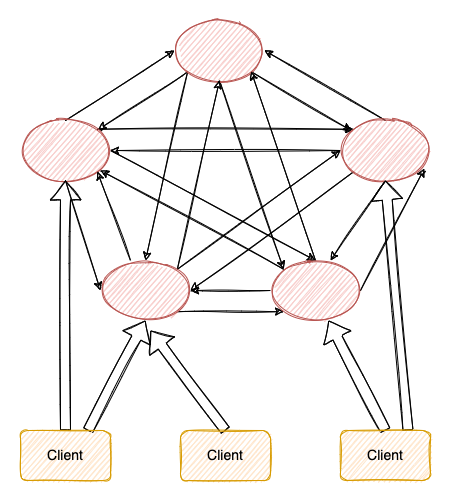
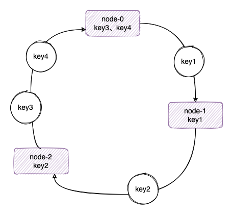
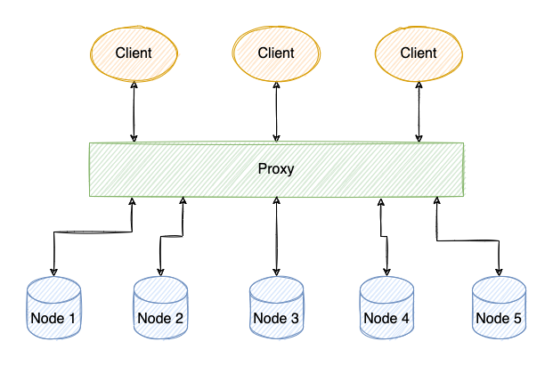
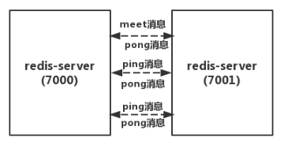
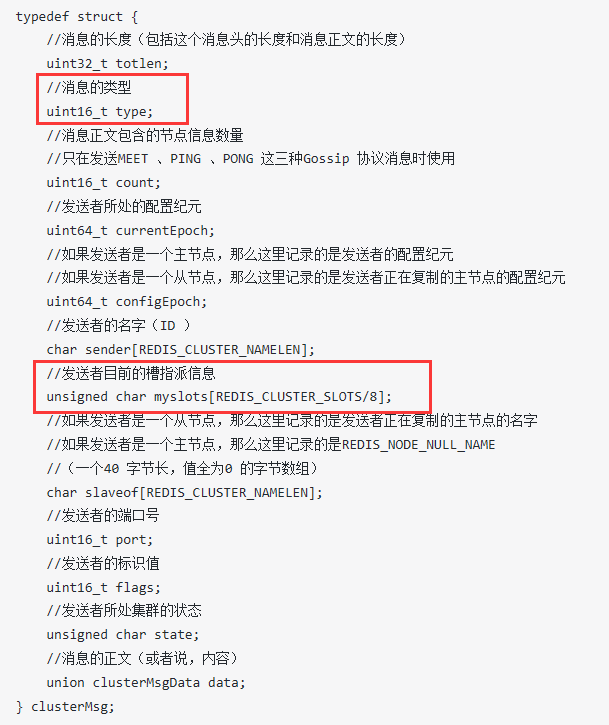

## 一、 集群模式

### 1、Redis 集群搭建有几种模式？

* **主从模式**

和 `MySQL` 需要主从复制的原因一样，`Redis` 虽然读写速度非常快，但是也会产生性能瓶颈，特别是在读压力上，为了分担压力，`Redis` 支持主从复制。`Redis` 的主从结构一主一从，一主多从或级联结构，
复制类型可以根据是否是全量而分为全量同步和增量同步。


* **哨兵模式**

在主从复制实现之后，如果想对 `master` 进行监控，`Redis` 提供了一种哨兵机制，哨兵的含义就是监控 `Redis` 系统的运行状态，通过投票机制，从 `slave` 中选举出新的 `master` 以保证集群正常运行。

还可以启用多个哨兵进行监控以保证集群足够稳健，这种情况下，哨兵不仅监控主从服务，哨兵之间也会相互监控。

* **Cluster 集群模式**



### 2、Redis 主从复制的实现？

主从复制可以根据需要分为`全量同步`的`增量同步`两种方式。

* **全量同步**

`Redis` 全量复制一般发生在 `slave` 的初始阶段，这时 `slave` 需要将 `master` 上的数据都复制一份，具体步骤如下：


1）`slave` 连接 `master`，发送 `SYNC` 命令；

2）`master` 接到 `SYNC` 命令后执行 `BGSAVE` 命令生产 `RDB` 文件，并使用缓冲区记录此后执行的所有写命令；

3）`master` 执行完 `BGSAVE` 后，向所有的 `slave` 发送快照文件，并在发送过程中继续记录执行的写命令；

4）`slave` 收到快照后，丢弃所有的旧数据，载入收到的数据；

5）`master` 快照发送完成后就会开始向 `slave` 发送缓冲区的写命令；

6）`slave` 完成对快照的载入，并开始接受命令请求，执行来自 `master` 缓冲区的写命令；

7）`slave` 完成上面的数据初始化后就可以开始接受用户的读请求了。

* **增量同步**

增量复制实际上就是在 `slave` 初始化完成后开始正常工作时 `master` 发生写操作同步到 `slave` 的过程。增量复制的过程主要是 `master` 每执行一个写命令就会向 `slave` 发送相同的写命令，
`slave` 接受并执行写命令，从而保持主从一致。

### 3、Redis 的主从同步策略？

**主从同步刚连接的时候进行全量同步，全量同步结束后开始增量同步。**

如果有需要，`slave` 在任何时候都可以发起全量同步，其主要策略就是无论如何首先会尝试进行增量同步，如果失败则会要求 `slave` 进行全量同步，之后再进行增量同步。

注意：如果多个 `slave` 同时断线需要重启的时候，因为只要 `slave` 启动，就会和 `master` 建立连接发送`SYNC`请求和主机全量同步，如果多个同时发送 `SYNC` 请求，
可能导致 `master IO` 突增而发送宕机。所以我们要避免多个 `slave` 同时恢复重启的情况。

### 4、哨兵模式的原理？

哨兵主要用于管理多个 `Redis` 服务器，主要有以下三个任务：`监控`、`提醒`以及`故障转移`。

每个哨兵会向`其它哨兵`、`master`、`slave` 定时发送消息，以确认对方是否还存活。如果发现对方在配置的指定时间内未回应，则暂时认为对方已挂。若`“哨兵群”`中的多数 `sentinel` 都报告某一 `master` 没响应，
系统才认为该 `master “彻底死亡”`，通过一定的 `vote` 算法从剩下的 `slave` 节点中选一台提升为 `master`，然后自动修改相关配置。

### 5、哨兵模式故障迁移流程？

1）首先是从主服务器的从服务器中选出一个从服务器作为新的主服务器。

>选点的依据依次是：
>
> `网络连接正常` -> `5 秒内回复过 INFO 命令` -> `10*down-after-milliseconds 内与主连接过的` -> `从服务器优先级` -> `复制偏移量` -> `运行id较小的`

2）选出之后通过 `slaveif no ont` 将该从服务器升为新主服务器；

3）然后再通过 `slaveof ip port` 命令让其他从服务器复制该信主服务器。

**缺点**

* 主从服务器的数据要经常进行主从复制，这样会造成性能下降
* 当主服务器宕机后，从服务器切换成主服务器的那段时间，服务是不可用的

## 二、 Cluster 集群

### 1、什么是一致性 Hash 以及解决什么问题？

`一致性 hash` 其实是普通 hash 算法的改良版，其 `hash` 计算方法没有变化，但是 `hash` 空间发生了变化，由原来的线性的变成了环。

缓存 `key` 通过 `hash` 计算之后得到在 `hash` 环中的位置，然后顺时针方向找到第一个节点，这个节点就是存放 `key` 的节点。



由此可见，**一致性 hash 主要是为了解决普通 hash 中扩容和宕机的问题。**

同时还可以通过虚拟节点来解决数据倾斜的问题：就是在节点稀疏的 `hash` 环上对物理节点虚拟出一部分虚拟节点，`key` 会打到虚拟节点上面，而虚拟节点上的 `key` 实际也是映射到物理节点上的，
这样就避免了数据倾斜导致单节点压力过大导致节点雪崩的问题。


详情移步：[一致性Hash算法](/开发技巧/算法/常见算法/一致性Hash算法)

### 2、Cluster 模式的原理？

其实现原理就是`一致性 Hash`。`Redis Cluster` 中有一个 `16384` 长度的`槽`的概念，他们的编号为 `0、1、2、3 …… 16382、16383`。这个槽是一个虚拟的槽，并不是真正存在的。正常工作的时候，`Redis Cluster` 中的每个 `Master` 节点都会负责一部分的槽，
当有某个 `key` 被映射到某个 `Master` 负责的槽，那么这个 `Master` 负责为这个 `key` 提供服务。

至于哪个 `Master` 节点负责哪个槽，这是可以由用户指定的，也可以在初始化的时候自动生成（`redis-trib.rb`脚本）。这里值得一提的是，在 `Redis Cluster` 中，只有 `Master` 才拥有槽的所有权，如果是某个 `Master` 的 `slave`，这个`slave`只负责槽的使用，但是没有所有权。

### 3、Cluster 的分片机制？

为了使得集群能够水平扩展，首要解决的问题就是如何将整个数据集按照一定的规则分配到多个节点上。对于客户端请求的 `key`，根据公式 `HASH_SLOT=CRC16(key) mod 16384`，计算出映射到哪个分片上。而对于 `CRC16` 算法产生的 `hash` 值会有 `16bit`，可以产生 `2^16-=65536` 个值。

`Redis` 集群提供了灵活的节点扩容和收缩方案。在不影响集群对外服务的情况下，可以为集群添加节点进行扩容也可以下线部分节点进行缩容。可以说，槽是 `Redis` 集群管理数据的基本单位，集群伸缩就是槽和数据在节点之间的移动。

### 4、Cluster 集群的扩容流程？

当一个 `Redis` 新节点运行并加入现有集群后，我们需要为其迁移槽和数据。首先要为新节点指定槽的迁移计划，确保迁移后每个节点负责相似数量的槽，从而保证这些节点的数据均匀。

1）首先启动一个 `Redis` 节点，记为 `M4`。

2）使用 `cluster meet` 命令，让新 `Redis` 节点加入到集群中。新节点刚开始都是主节点状态，由于没有负责的槽，所以不能接受任何读写操作，后续给他迁移槽和填充数据。

3）对 `M4` 节点发送 `cluster setslot { slot } importing { sourceNodeId }` 命令，让目标节点准备导入槽的数据。

4）对源节点，也就是 `M1，M2，M3` 节点发送 `cluster setslot { slot } migrating { targetNodeId }` 命令，让源节点准备迁出槽的数据。

5）源节点执行 `cluster getkeysinslot { slot } { count }` 命令，获取 `count` 个属于槽 `{ slot }` 的键，然后执行步骤 `6）`的操作进行迁移键值数据。

6）在源节点上执行 `migrate { targetNodeIp} " " 0 { timeout } keys { key... }` 命令，把获取的键通过 `pipeline` 机制批量迁移到目标节点，批量迁移版本的 `migrate` 命令在 `Redis 3.0.6` 以上版本提供。

7）重复执行步骤 `5）`和步骤 `6）` 直到槽下所有的键值数据迁移到目标节点。

8）向集群内所有主节点发送 `cluster setslot { slot } node { targetNodeId }` 命令，通知槽分配给目标节点。为了保证槽节点映射变更及时传播，需要遍历发送给所有主节点更新被迁移的槽执行新节点。

### 5、Cluster 集群收缩流程？

收缩节点就是将 `Redis` 节点下线，整个流程需要如下操作流程。

1）首先需要确认下线节点是否有负责的槽，如果是，需要把槽迁移到其他节点，保证节点下线后整个集群槽节点映射的完整性。

2）当下线节点不再负责槽或者本身是从节点时，就可以通知集群内其他节点忘记下线节点，当所有的节点忘记改节点后可以正常关闭。

### 6、客户端如何路由？

既然 `Redis` 集群中的数据是分片存储的，那我们该如何知道某个 `key` 存在哪个节点上呢？即我们需要一个查询路由，该路由根据给定的 `key`，返回存储该键值的机器地址。

常规的实现方式便是采用如下图所示的代理方案，即采用一个中央节点（比如`HDFS`中的`NameNode`）来管理所有的元数据，但是这样的方案带来的最大问题就是代理节点很容易成为访问的瓶颈，当读写并发量高的时候，代理节点会严重的拖慢整个系统的性能。



`Redis` 并没有选择使用代理，而是客户端直接连接每个节点。`Redis` 的每个节点中都存储着整个集群的状态，集群状态中一个重要的信息就是每个桶的负责节点。在具体的实现中，`Redis` 用一个大小固定为 `CLUSTER_SLOTS` 的 `clusterNode` 数组 `slots` 来保存每个桶的负责节点。

```redis
typedef struct clusterNode {
    ...
    unsigned char slots[CLUSTER_SLOTS/8];
    ...
} clusterNode;

typedef struct clusterState {
    // slots记录每个桶被哪个节点存储
    clusterNode *slots[CLUSTER_SLOTS];
    ...
} clusterState;
```

在集群模式下，`Redis` 接收任何键相关命令时首先计算键对应的桶编号，再根据桶找出所对应的节点，如果节点是自身，则处理键命令；否则回复 `MOVED` 重定向错误，通知客户端请求正确的节点，这个过程称为 `MOVED 重定向`。重定向信息包含了键所对应的桶以及负责该桶的节点地址，根据这些信息客户端就可以向正确的节点发起请求。

### 7、为什么是 163834 个槽位？

我们回忆一下`Redis Cluster`的工作原理！

这里要先将节点握手讲清楚。我们让两个`redis`节点之间进行通信的时候，需要在客户端执行下面一个命令:

```redis
127.0.0.1:7000>cluster meet 127.0.0.1:7001
```

意思很简单，让`7000节点`和`7001节点`知道彼此存在！

在握手成功后，连个节点之间会定期发送`ping/pong`消息，交换数据信息，如下图所示。



在这里，我们需要关注三个重点。

* (1)交换什么数据信息
* (2)数据信息究竟多大
* (3)定期的频率什么样

交换的数据信息，由消息体和消息头组成。

消息体无外乎是一些`节点标识`，`IP`，`端口号`，`发送时间`等

我们来看消息头，结构如下:



注意看红框的内容，`type`表示消息类型。

另外，消息头里面有个`myslots`的`char`数组，长度为`16383/8`，这其实是一个`bitmap`,每一个位代表一个槽，如果该位为`1`，表示这个槽是属于这个节点的。

**到底数据信息究竟多大？**

在消息头中，最占空间的是`myslots[CLUSTER_SLOTS/8]`。这块的大小是: `16384÷8÷1024=2kb`

那在消息体中，会携带一定数量的其他节点信息用于交换。 约为集群总节点数量的`1/10`，至少携带`3`个节点的信息。

这里的重点是:**节点数量越多，消息体内容越大**。 消息体大小是`10`个节点的状态信息约`1kb`。

**那定期的频率是什么样的？**

`redis`集群内节点，每秒都在发`ping`消息。规律如下:

* 1） 每秒会随机选取`5`个节点，找出最久没有通信的节点发送`ping`消息
* 2） 每`100`毫秒(`1`秒`10`次)都会扫描本地节点列表，如果发现节点最近一次接受`pong`消息的时间大于`cluster-node-timeout/2` 则立刻发送`ping`消息

因此，每秒单节点发出`ping`消息数量为: `数量=1+10*num（node.pong_received>cluster_node_timeout/2）`

**所以**

* 1） 如果槽位为`65536`，发送心跳信息的消息头达`8k`，发送的心跳包过于庞大。

如上所述，在消息头中，最占空间的是`myslots[CLUSTER_SLOTS/8]`。 当槽位为`65536`时，这块的大小是: `65536÷8÷1024=8kb`。因为每秒钟，`redis`节点需要发送一定数量的`ping`消息作为心跳包，如果槽位为`65536`，这个`ping`消息的消息头太大了，`浪费带宽`。

* 2）`redis`的集群主节点数量基本不可能超过`1000`个。

如上所述，集群节点越多，心跳包的消息体内携带的数据越多。如果节点过`1000`个，也会导致网络拥堵。因此`redis`作者，不建议`redis cluster`节点数量超过`1000`个。 那么，对于节点数在`1000`以内的`redis cluster`集群，`16384`个槽位够用了。没有必要拓展到`65536`个。

* 3）槽位越小，节点少的情况下，压缩比高。

`Redis`主节点的配置信息中，它所负责的哈希槽是通过一张`bitmap`的形式来保存的，在传输过程中，会对`bitmap`进行压缩，但是如果`bitmap`的填充率`slots / N`很高的话(`N`表示节点数)，`bitmap`的压缩率就很低。 如果节点数很少，而哈希槽数量很多的话，`bitmap`的压缩率就很低。

### 8、集群的故障发现与迁移？

**故障发现**

当集群内某个节点出现问题时，需要通过一种健壮的方式保证识别出节点是否发生了故障。`Redis`集群内节点通过`ping/pong`消息实现节点通信，消息不但可以传播节点槽信息，还可以传播其他状态如：`主从状态`、`节点故障`等。因此故障发现也是通过消息传播机制实现的，
主要环节包括：`主观下线(PFAIL-Possibly Fail)`和`客观下线(Fail)`

* **主观下线**：指某个节点认为另一个节点不可用，即下线状态，这个状态并不是最终的故障判定，只能代表一个节点的意见，可能存在误判情况。 

* **客观下线**：指标记一个节点真正的下线，集群内多个节点都认为该节点不可用，从而达成共识的结果。如果是持有槽的主节点故障，需要为该节点进行故障转移。

一个节点认为某个节点失联了并不代表所有的节点都认为它失联了。所以集群还得经过一次协商的过程，只有当大多数节点都认定了某个节点失联了，集群才认为该节点需要进行主从切换来容错。`Redis` 集群节点采用 `Gossip` 协议来广播自己的状态以及自己对整个集群认知的改变。
比如一个节点发现某个节点失联了(`PFail`)，它会将这条信息向整个集群广播，其它节点也就可以收到这点失联信息。如果一个节点收到了某个节点失联的数量 (`PFail Count`) 已经达到了集群的大多数，就可以标记该节点为确定下线状态 (`Fail`)，然后向整个集群广播，
强迫其它节点也接收该节点已经下线的事实，并立即对该失联节点进行主从切换。

详情移步：[Redis Cluster故障转移原理](https://www.jianshu.com/p/5e5e0b98a143)

