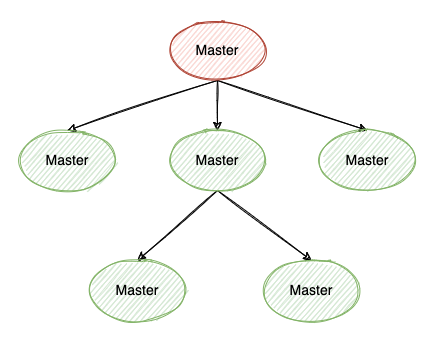
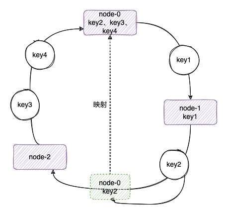

## 一、 集群模式

### 1、Redis 集群搭建有几种模式？

* **主从模式**

和 `MySQL` 需要主从复制的原因一样，`Redis` 虽然读写速度非常快，但是也会产生性能瓶颈，特别是在读压力上，为了分担压力，`Redis` 支持主从复制。`Redis` 的主从结构一主一从，一主多从或级联结构，
复制类型可以根据是否是全量而分为全量同步和增量同步。

* **哨兵模式**

在主从复制实现之后，如果想对 `master` 进行监控，`Redis` 提供了一种哨兵机制，哨兵的含义就是监控 `Redis` 系统的运行状态，通过投票机制，从 `slave` 中选举出新的 `master` 以保证集群正常运行。

还可以启用多个哨兵进行监控以保证集群足够稳健，这种情况下，哨兵不仅监控主从服务，哨兵之间也会相互监控。

* **Cluster 集群模式**

### 2、Redis 主从复制的实现？

主从复制可以根据需要分为`全量同步`的`增量同步`两种方式。

* **全量同步**

`Redis` 全量复制一般发生在 `slave` 的初始阶段，这时 `slave` 需要将 `master` 上的数据都复制一份，具体步骤如下：

1）`slave` 连接 `master`，发送 `SYNC` 命令；

2）`master` 接到 `SYNC` 命令后执行 `BGSAVE` 命令生产 `RDB` 文件，并使用缓冲区记录此后执行的所有写命令；

3）`master` 执行完 `BGSAVE` 后，向所有的 `slave` 发送快照文件，并在发送过程中继续记录执行的写命令；

4）`slave` 收到快照后，丢弃所有的旧数据，载入收到的数据；

5）`master` 快照发送完成后就会开始向 `slave` 发送缓冲区的写命令；

6）`slave` 完成对快照的载入，并开始接受命令请求，执行来自 `master` 缓冲区的写命令；

7）`slave` 完成上面的数据初始化后就可以开始接受用户的读请求了。

* **增量同步**

增量复制实际上就是在 `slave` 初始化完成后开始正常工作时 `master` 发生写操作同步到 `slave` 的过程。增量复制的过程主要是 `master` 每执行一个写命令就会向 `slave` 发送相同的写命令，
`slave` 接受并执行写命令，从而保持主从一致。

### 3、Redis 的主从同步策略？

**主从同步刚连接的时候进行全量同步，全量同步结束后开始增量同步。**

如果有需要，`slave` 在任何时候都可以发起全量同步，其主要策略就是无论如何首先会尝试进行增量同步，如果失败则会要求 `slave` 进行全量同步，之后再进行增量同步。

注意：如果多个 `slave` 同时断线需要重启的时候，因为只要 `slave` 启动，就会和 `master` 建立连接发送`SYNC`请求和主机全量同步，如果多个同时发送 `SYNC` 请求，
可能导致 `master IO` 突增而发送宕机。所以我们要避免多个 `slave` 同时恢复重启的情况。

### 4、哨兵模式的原理？

哨兵主要用于管理多个 `Redis` 服务器，主要有以下三个任务：`监控`、`提醒`以及`故障转移`。

每个哨兵会向`其它哨兵`、`master`、`slave` 定时发送消息，以确认对方是否还存活。如果发现对方在配置的指定时间内未回应，则暂时认为对方已挂。若`“哨兵群”`中的多数 `sentinel` 都报告某一 `master` 没响应，
系统才认为该 `master “彻底死亡”`，通过一定的 `vote` 算法从剩下的 `slave` 节点中选一台提升为 `master`，然后自动修改相关配置。

### 5、哨兵模式故障迁移流程？

1）首先是从主服务器的从服务器中选出一个从服务器作为新的主服务器。

>选点的依据依次是：
>
> `网络连接正常` -> `5 秒内回复过 INFO 命令` -> `10*down-after-milliseconds 内与主连接过的` -> `从服务器优先级` -> `复制偏移量` -> `运行id较小的`

2）选出之后通过 `slaveif no ont` 将该从服务器升为新主服务器；

3）然后再通过 `slaveof ip port` 命令让其他从服务器复制该信主服务器。

**缺点**

* 主从服务器的数据要经常进行主从复制，这样会造成性能下降
* 当主服务器宕机后，从服务器切换成主服务器的那段时间，服务是不可用的

## 二、 Cluster 集群

### 1、什么是一致性 Hash 以及解决什么问题？

`一致性 hash` 其实是普通 hash 算法的改良版，其 `hash` 计算方法没有变化，但是 `hash` 空间发生了变化，由原来的线性的变成了环。

缓存 `key` 通过 `hash` 计算之后得到在 `hash` 环中的位置，然后顺时针方向找到第一个节点，这个节点就是存放 `key` 的节点。

由此可见，**一致性 hash 主要是为了解决普通 hash 中扩容和宕机的问题。**

同时还可以通过虚拟节点来解决数据倾斜的问题：就是在节点稀疏的 `hash` 环上对物理节点虚拟出一部分虚拟节点，`key` 会打到虚拟节点上面，而虚拟节点上的 `key` 实际也是映射到物理节点上的，
这样就避免了数据倾斜导致单节点压力过大导致节点雪崩的问题。

详情移步：[一致性Hash算法](/开发技巧/算法/常见算法/一致性Hash算法)

